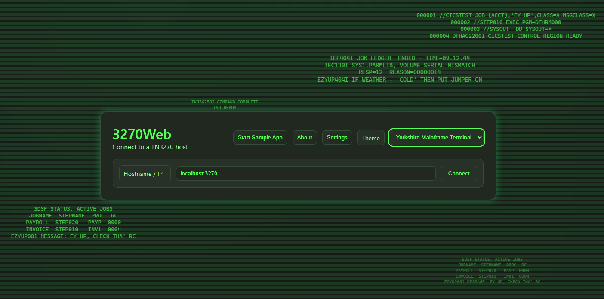

# 3270Web

Web-based 3270 terminal interface in Go with session recording to a 3270Connect-compatible workflow.

## Features
- Web UI for 3270 sessions
- Embedded s3270 binary support (Windows)
- Record sessions to workflow.json, compatible with 3270Connect (Connect/FillString/Press keys/Disconnect)
- Load workflow.json and play it back
- Docker image and GHCR workflow
- Windows build script

> **Windows SmartScreen notice**  
> This app is digitally signed.  
> If Windows shows **“protected your PC”**, click **More info → Run anyway**.  
> The warning disappears automatically as usage grows.

## Screenshots




## Requirements
- Go 1.22+
- Access to a 3270 host

## Run locally
```bash
go run ./cmd/3270Web
```
Then open http://localhost:8080

## Build Windows EXE
```powershell
.\scripts\build-windows.ps1
```
This produces `3270Web.exe` in the repo root.

## Docker
```bash
docker build -t 3270web .
docker run -p 8080:8080 3270web
```
The Docker image installs the `s3270` package so it is available at `/usr/bin/s3270`.

## Recording workflow.json
1. Connect to a host.
2. Click **Start Recording**.
3. Interact with the screen (edits + Enter/PF keys).
4. Click **Stop Recording**.
5. Download `workflow.json`.

To replay a workflow, use **Load workflow and Play** on the session screen.

The output matches the 3270Connect workflow format. See [Workflow Configuration](docs/workflow.md) for file format details.

## Sample applications
Sample apps now spin up local Go-based 3270 servers (from the 3270Connect examples) and connect via s3270, instead of loading dump files. Use the **Start Example App** button to launch one on the selected port.

## Configuration
The application loads `webapp/WEB-INF/3270Web-config.xml` if present. If missing, defaults are used.

See the [Configuration Reference](docs/configuration.md) for details on available options, including:
- Customizing the `s3270` execution path and model
- Setting a default target host and auto-connect behavior
- Defining custom color schemes and fonts

An optional `.env` file (created with defaults on first run) lets you override the full set of `s3270` command-line options using `S3270_*` environment variables.

## Documentation Site

Project documentation is built with MkDocs and published from `gh-pages` at:

`https://3270Web.3270.io`

Local docs commands:

```bash
pip install -r requirements-docs.txt
mkdocs serve
```
