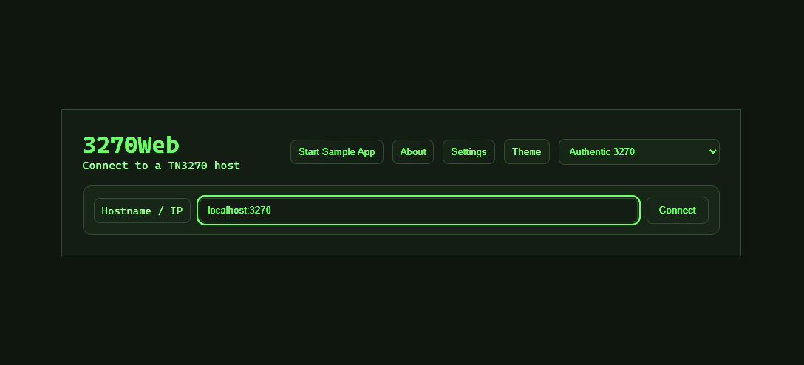
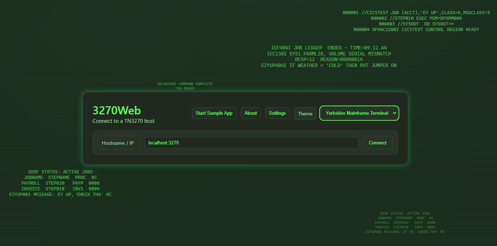
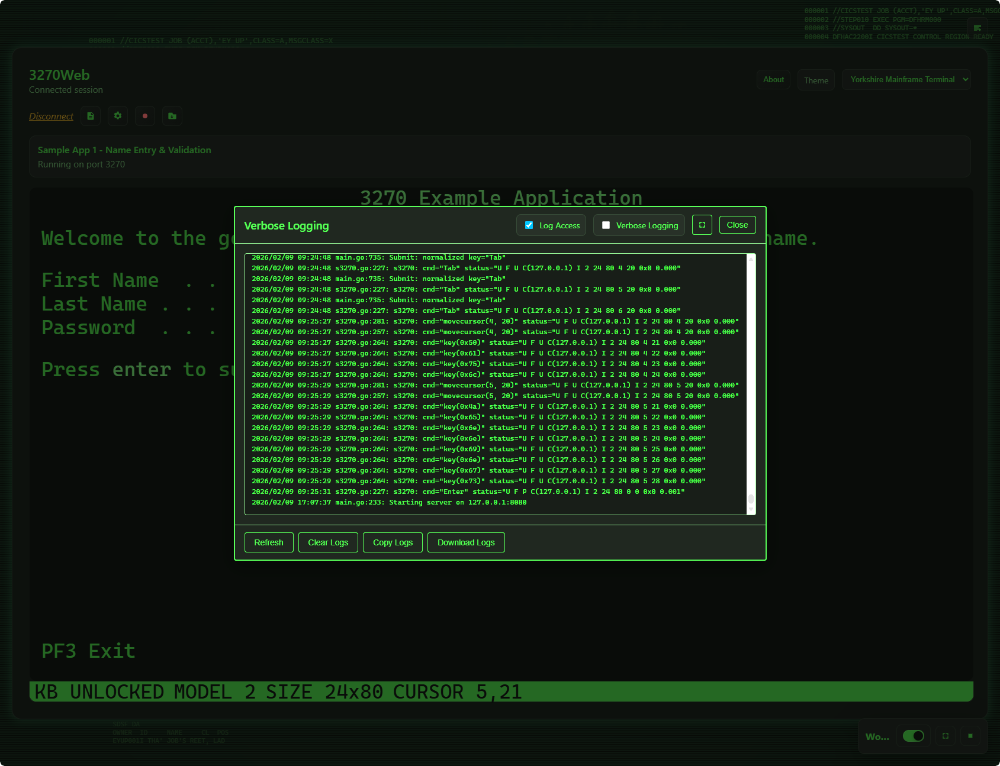
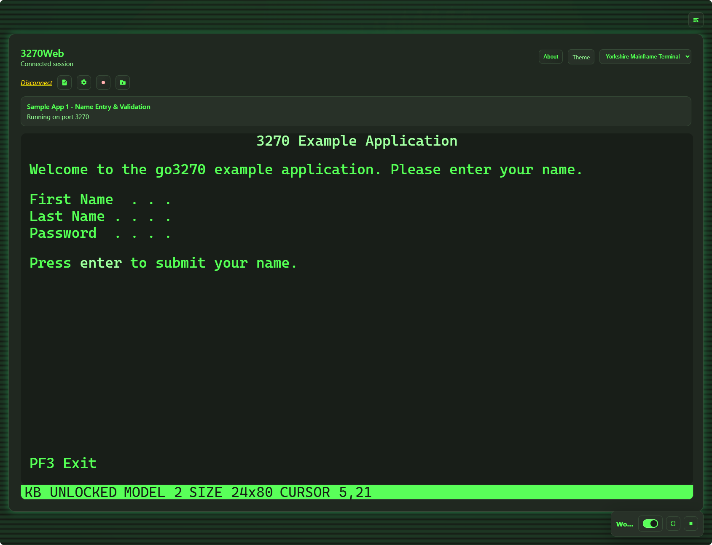

# 3270Web

Web-based 3270 terminal interface in Go with session recording to a 3270Connect-compatible workflow.

## Features
- Web UI for 3270 sessions
- Embedded s3270 binary support (Windows)
- Print screen (renders the current screen via s3270 `PrintText` and opens a printable view in a new tab)
- Public REST/JSON API at `/api/v1/*` for RPA bots and CI jobs (opt-in via `API_TOKEN`; see [docs/rest-api.md](docs/rest-api.md))
- Record sessions to workflow.json, compatible with 3270Connect (Connect/FillString/Press keys/Disconnect)
- Load workflow.json and play it back
- Chaos mode for automated exploration, run persistence, and workflow JSON export
- AI Chat side panel — type instructions in plain language to read screens, fill fields, send keys, and run automated exploration (GitHub Copilot / Claude)
- Docker image and GHCR workflow
- Windows build script

> **Windows SmartScreen notice**  
> This app is digitally signed.  
> If Windows shows **“protected your PC”**, click **More info → Run anyway**.  
> The warning disappears automatically as usage grows.

## Screenshots






## Requirements
- Go 1.22+
- Access to a 3270 host

## Run locally
```bash
go run ./cmd/3270Web
```
Then open http://localhost:8080

## Build Windows EXE
```powershell
.\scripts\build-windows.ps1
```
This produces `3270Web.exe` in the repo root.

## Docker
```bash
docker build -t 3270web .
docker run -p 8080:8080 3270web
```
The Docker image installs the `s3270` package so it is available at `/usr/bin/s3270`.

## Recording workflow.json
1. Connect to a host.
2. Click **Start Recording**.
3. Interact with the screen (edits + Enter/PF keys).
4. Click **Stop Recording**.
5. Download `workflow.json`.

To replay a workflow, use **Load workflow and Play** on the session screen.

The output matches the 3270Connect workflow format. See [Workflow Configuration](docs/workflow.md) for file format details.

## Chaos mode

Chaos mode explores screens by writing generated values into input fields and submitting AID keys (`Enter`, `Tab`, `PF*`, and others). It is useful for discovering navigation paths and generating reusable workflow JSON.

The chaos JSON output remains a **3270Connect-compatible workflow** (`Connect` / `FillString` / `PressEnter` / `PressPF<n>` / `Disconnect` steps) — drop a chaos run's JSON straight into `3270Connect run -config workflow.json` to use it as a volume test. The output file is written automatically on any termination reason (max steps, time budget, saturation, error, stop).

Recent additions:
- **Saturation detection** — runs stop early with `terminationReason: "saturated"` once `saturation_steps` (default 15) consecutive attempts produce no new screen, transition, or productive value.
- **Auto-block exit keys** — chaos parses the bottom-row PF legend and blocks Exit/Quit/Cancel/Logoff keys for the rest of the run.
- **Structural mind-map dedup** — screens that differ only by echoed protected text collapse into one area. Set `dedup_mode: "exact"` for the previous raw-hash behaviour.
- **chaos_report tool** — `POST /chaos/report` returns a Markdown discovery report (ASCII screen graph, per-screen stats, suggested experiments).
- **Mind-map export/import** — `GET /chaos/mindmap/export` and `POST /chaos/mindmap/import` let learning carry across sessions.
- **Verbose flag on chaos_status** — pass `?verbose=true` (or `{verbose: true}` to the Copilot tool) for the full mind map; default is a slim summary.
- **JSONL transition log** — set `transition_log_path` (or `CHAOS_TRANSITION_LOG_PATH` env var) and chaos appends one JSON object per attempt to the file.
- **Snake_case + camelCase** — every chaos tool body now binds both forms, so the documented snake_case keys (`screen_hash`, `max_steps`, etc.) work directly without manual translation.

### Toolbar flow
1. Connect to a host.
2. Click **Start chaos exploration**.
3. Monitor progress from:
   - the toolbar indicators/stats, and
   - the Workflow Status widget (attempt details, transitions, errors).
4. Stop with **Stop chaos exploration** or let limits/time budget finish the run.
5. Export with **Download chaos workflow JSON**.

### Saved runs
- Completed runs are persisted and can be loaded from **Load previous chaos run**.
- You can seed chaos from the currently loaded recording with **Load recording into chaos**.
- You can continue a loaded run with **Resume chaos exploration from loaded run**.
- You can clear completed/loaded run state from the toolbar with **Remove chaos run**.
- Run artifacts are stored under the local `chaos-runs/` directory.
- Chaos output files are isolated from loaded recording filenames to avoid overwrite collisions.

### Chaos hints
- Open **Edit chaos hints** from the chaos toolbar.
- Add one or more hints with:
  - a known transaction code, and/or
  - known working data values (comma or newline separated), and/or
  - key assignment mappings (`Screen Label = Key`, for example `Return = PF3`, `Confirm = Enter`).
- Use **Load from recording** in the hints modal to import hint candidates from a previous recording JSON.
- Click **Save hints** to persist hints, or **Load saved** to reload the current saved set.
- Saved hints are stored in `chaos-hints.json` and are automatically used by chaos start/resume when request-level hints are not provided.

### Chaos settings
Chaos behavior can be tuned in **Settings -> Chaos** or via environment values:
- `CHAOS_MAX_STEPS`
- `CHAOS_TIME_BUDGET_SEC`
- `CHAOS_STEP_DELAY_SEC`
- `CHAOS_SEED`
- `CHAOS_MAX_FIELD_LENGTH`
- `CHAOS_OUTPUT_FILE`
- `CHAOS_EXCLUDE_NO_PROGRESS_EVENTS`

See [Chaos Mode](docs/chaos-mode.md) for full details.

## AI Chat mode

AI Chat mode is a side panel that lets you drive a 3270 session through conversation with an AI assistant. Type instructions in plain language; the AI reads the current screen, fills fields, presses keys, and runs chaos exploration — pausing before each action for your approval.

### Getting started

1. Connect to a host.
2. Click the **Open Copilot chat** toolbar button.
3. Sign in with GitHub (one-time OAuth device flow — copy a code, visit the verification URL, approve).
4. Type a message, for example: *"Read the current screen and tell me what options are available."*
5. Click **Run** to approve each proposed tool call, or enable **Auto Mode** to let the AI proceed automatically.

### What the AI can do

- Read the current screen (ASCII text + full field map)
- Write text into unprotected fields
- Send any AID key (`Enter`, `PF1`–`PF24`, `PA1`–`PA3`, `Tab`, arrow keys, and more)
- Start, stop, resume, and report on chaos exploration runs
- Export learned navigation paths as 3270Connect-compatible workflow JSON
- Ask you questions with clickable answer buttons (`ask_user` tool)

The model selector dropdown lets you switch between available Copilot models (default: Claude Opus 4).

See [AI Chat Mode](docs/ai-chat.md) for full details.

## Sample applications
Sample apps now spin up local Go-based 3270 servers (from the 3270Connect examples) and connect via s3270, instead of loading dump files. Use the **Start Example App** button to launch one on the selected port.

## Configuration
The application loads `webapp/WEB-INF/3270Web-config.xml` if present. If missing, defaults are used.

See the [Configuration Reference](docs/configuration.md) for details on available options, including:
- Customizing the `s3270` execution path and model
- Setting a default target host and auto-connect behavior
- Defining custom color schemes and fonts

An optional `.env` file (created with defaults on first run) lets you override the full set of `s3270` command-line options using `S3270_*` environment variables.

## Documentation Site

Project documentation is built with MkDocs and published from `gh-pages` at:

`https://3270Web.3270.io`

Local docs commands:

```bash
pip install -r requirements-docs.txt
mkdocs serve
```
