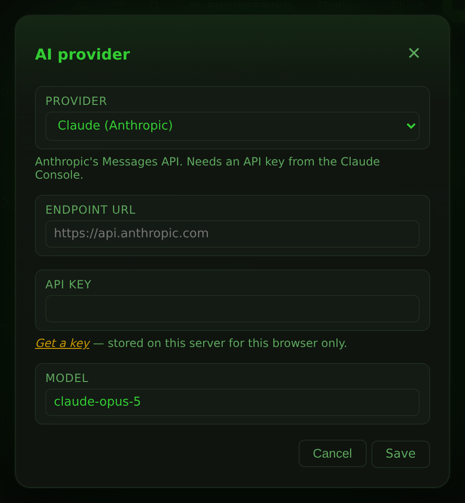

# AI Providers

[AI Chat Mode](ai-chat.md) can talk to more than one AI service. Pick the one
that matches your licensing, your data-residency rules, or your hardware —
GitHub Copilot, Claude, OpenAI, Google AI, Ollama running on your own machine,
or any endpoint that serves the OpenAI `/chat/completions` API.

Everything else about the panel is identical whichever you choose: the same
tools, the same per-call approval, the same chaos and business-understanding
workflows.

## Choose a provider

1. Open the AI chat panel and click **Provider** in its header — or press
   ++ctrl+k++ and run *AI provider settings*.
2. Choose a provider from the dropdown. The dialog reshapes itself to ask for
   what that provider needs.
3. Click **Save**.

The panel's header shows which provider you are connected to, and each reply
is labelled with it, so a conversation is never ambiguous about who answered.



## Supported providers

| Provider | Authentication | Endpoint | Notes |
|---|---|---|---|
| **GitHub Copilot** | GitHub sign-in | fixed | The default. No API key to manage. |
| **Claude (Anthropic)** | API key | `https://api.anthropic.com` | Uses the Messages API. |
| **OpenAI** | API key | `https://api.openai.com/v1` | |
| **Google AI (Gemini)** | API key | `https://generativelanguage.googleapis.com/v1beta/openai` | Gemini's OpenAI-compatible endpoint. |
| **Ollama (local)** | usually none | `http://localhost:11434/v1` | A model on your machine or LAN. |
| **Ollama Cloud** | API key | `https://ollama.com/v1` | Ollama's hosted models. |
| **OpenAI-compatible endpoint** | optional key | you supply it | vLLM, LM Studio, OpenRouter, Groq, a corporate gateway. |

### GitHub Copilot

Select **GitHub Copilot** and click **Sign in with GitHub**. A dialog opens
with a verification link and a one-time code:

1. Use **Copy** to grab the code.
2. Open the link, enter the code, and approve the access request.
3. Leave the dialog open and return to 3270Web — it polls automatically and
   signs you in once you approve.

Models come from your Copilot plan, so what appears in the dropdown depends on
your GitHub account.

#### GitHub Enterprise

GitHub Enterprise is supported, but there is no button for it in the UI. Point
3270Web at your instance by calling the REST endpoint **before** signing in:

```bash
curl -X POST http://localhost:8080/api/copilot/enterprise \
  -H 'Content-Type: application/json' \
  -d '{"url":"ghe.example.com"}'
```

The value must be a bare hostname (optionally with a port) — for example
`ghe.example.com`, not `https://ghe.example.com/`. Pass an empty string to
clear it and go back to github.com.

### Claude, OpenAI, Google AI and Ollama Cloud

These four need an API key and nothing else. Select the provider, paste the key
into **API key**, and save. The dialog links to the page where each vendor
issues keys.

Leave **Endpoint URL** alone unless you are routing through a proxy or a
regional endpoint.

### Ollama (local)

Ollama needs no key. Install it, pull a model that supports tool calling, and
make sure it is serving:

```bash
ollama pull qwen3
ollama serve
```

Then select **Ollama (local)** and save. The default endpoint is
`http://localhost:11434/v1`.

!!! note "Where 'localhost' points"
    The endpoint is called by the **3270Web server**, not by your browser. If
    you run 3270Web in Docker and Ollama on the host, `localhost` inside the
    container is the container itself — use `http://host.docker.internal:11434/v1`
    (or the host's LAN address) instead.

Ollama on another machine works the same way: give it that machine's address,
and start Ollama with `OLLAMA_HOST=0.0.0.0` so it accepts remote connections.

### OpenAI-compatible endpoint

Use this for anything that serves `/chat/completions` in the OpenAI shape.
Fill in **Endpoint URL** with the directory containing `chat/completions` —
for most servers that means including the `/v1` suffix:

| Service | Endpoint URL |
|---|---|
| vLLM | `http://your-host:8000/v1` |
| LM Studio | `http://localhost:1234/v1` |
| OpenRouter | `https://openrouter.ai/api/v1` |
| Groq | `https://api.groq.com/openai/v1` |

Add an API key if the endpoint requires one, and type the model name into
**Model** — 3270Web asks the endpoint for its model list, but a server that
does not implement `/models` needs the name entering by hand.

## Models

The model dropdown sits above the input box. 3270Web asks the selected provider
for its live catalogue each time you open the panel; when that call cannot be
made — no key entered yet, or an endpoint with no `/models` route — it falls
back to a short built-in list so the dropdown is never empty.

Each provider keeps its own model, so switching provider and back does not
reset your choice.

!!! warning "Tool calling is required"
    The assistant works by calling tools (`get_screen`, `send_key`,
    `write_field`, the chaos and business tools). Every hosted model listed
    above supports that. Small local models often do not, or do it unreliably
    — if the assistant describes what it *would* do instead of reading the
    screen, pick a model advertised as supporting tools.

## Where credentials are stored

API keys and the Copilot OAuth token are stored **on the 3270Web server**, in
the per-user configuration directory (`$XDG_CONFIG_HOME/3270Web` on Linux, the
OS user-config directory elsewhere), in files readable only by the account
running 3270Web.

They are scoped to one browser: a long-lived cookie identifies your browser,
and each browser gets its own settings file. On a shared instance that means
your key is not visible to — and not usable by — anyone else who loads the same
URL. Keys are never sent back to the browser; the settings dialog can only tell
you *that* a key is saved, not what it is.

To remove a stored credential, click **Sign out** in the panel header, or
reopen the provider dialog and save an empty key.

!!! note "Anyone with your browser session can spend your key"
    Chat requests are proxied by the server using the stored key, so anyone who
    can reach 3270Web with your identity cookie can send requests that bill to
    your account. Treat a 3270Web instance the way you would treat any tool you
    have signed into.

## Endpoint restrictions

Custom endpoint URLs must be plain `http://` or `https://` origins. 3270Web
rejects URLs carrying credentials, a query string or a fragment, and rejects
link-local addresses (`169.254.0.0/16`), which is where cloud instance-metadata
services live. Private and loopback addresses are allowed — those are the whole
point of the local-Ollama and corporate-gateway cases.

## REST API

The provider layer is scriptable; see [REST API](rest-api.md#ai-provider) for
the full endpoint reference. In brief:

```bash
# What can I choose, and what is chosen now?
curl http://localhost:8080/api/ai/providers

# Select Claude and store a key
curl -X POST http://localhost:8080/api/ai/config \
  -H 'Content-Type: application/json' \
  -d '{"provider":"anthropic","apiKey":"sk-ant-...","model":"claude-opus-5"}'

# Is it ready to answer?
curl http://localhost:8080/api/ai/status
```

## Troubleshooting

| Symptom | Cause and fix |
|---|---|
| *"… needs an API key"* | No key saved for the selected provider. Open **Provider** and add one. |
| *"… rejected the credentials"* | The key is wrong, expired, or belongs to a different org. Re-paste it. |
| *"Could not reach … at its configured endpoint"* | The endpoint URL is wrong or the server is not running. For Docker, see the `localhost` note above. |
| *"The selected model … is not available"* | Your account or endpoint does not serve that model. Pick another from the dropdown. |
| Model dropdown shows only a few generic names | The live `/models` call failed, so the built-in fallback list is showing. Check the key and endpoint; you can still type an exact model name into the provider dialog. |
| Assistant replies in prose and never reads the screen | The model is not calling tools. Switch to a model that supports tool calling. |
