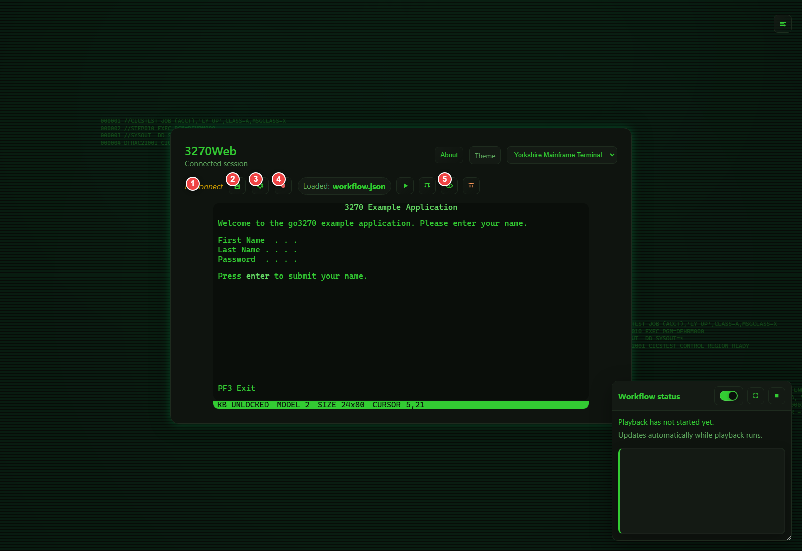

# Connect and Use 3270Web

This page explains connection setup and the full Settings modal from a user perspective.

## Connect to a Host

You can connect to:

- `hostname:port` (example: `mainframe.example.com:23`)
- `IPv4:port` (example: `10.0.0.5:23`)
- `IPv6:port` (example: `[::1]:23`)
- `sampleapp:<id>` for bundled sample targets

If autoconnect is enabled, 3270Web will connect automatically on startup.

## Open Settings

1. Click the Settings icon in the toolbar.
2. Use tabs to switch sections.
3. Edit values.
4. Click **Save settings**.
5. If prompted, restart 3270Web to apply startup-level changes.

You can also use:

- **Refresh** to reload current values
- **Reset to defaults** inside each settings section
- **Maximize** for easier editing of long values

## Toolbar Callouts

{: .doc-medal }
{: .doc-medal-wrap }

1. Disconnect
2. Logs
3. Settings
4. Start recording
5. View recording (when a recording is loaded)

## Settings Modal Callouts

{: .doc-medal }
{: .doc-medal-wrap }

1. Refresh values
2. Maximize/restore modal
3. Close settings
4. Section tabs
5. Active section content
6. Reset section to defaults
7. Save settings

## Settings Sections (Full)

### Connectivity

Controls how 3270Web reaches the host.

Includes:

- Port, connect timeout
- IPv4/IPv6 preference
- Proxy settings
- callback/script port and socket options

Use this section when you need alternate network routing or script protocol listeners.

### TLS/Security

Controls TLS certificate and protocol behavior.

Includes:

- Certificate verification toggle
- Min/max TLS protocol
- Client certificate and key files
- CA file/directory/chain
- Accepted hostname and client certificate name

Use this when connecting to secured hosts with custom certificate requirements.

### Emulation

Controls terminal identity and data representation.

Includes:

- Terminal model (`3278`/`3279` variants)
- Host code page
- Terminal/device/user identity options
- NVT mode and oversize behavior

This section directly affects screen size, field positions, and recording reliability.

### Automation/Startup

Controls startup and command automation behavior.

Includes:

- Exec command override
- Login macro
- HTTPD binding
- Minimum required s3270 version

Use this for scripted startup flows and custom launch behavior.

### Diagnostics

Controls trace and diagnostic output.

Includes:

- Trace enable/disable
- Trace file and max size
- Help/version/unit-test environment flags

Use this section when troubleshooting host interaction issues.

### App

Controls application-level UI features.

Includes:

- `Allow log access`
- `Use keypad` (show virtual keypad by default)

Use this section to control log visibility and default keyboard UI behavior.

### Chaos

Controls chaos exploration defaults.

Includes:

- `CHAOS_MAX_STEPS`
- `CHAOS_TIME_BUDGET_SEC`
- `CHAOS_STEP_DELAY_SEC`
- `CHAOS_SEED`
- `CHAOS_MAX_FIELD_LENGTH`
- `CHAOS_OUTPUT_FILE`
- `CHAOS_EXCLUDE_NO_PROGRESS_EVENTS`

Use this section to tune how aggressively chaos mode explores screens and where optional output should be written.

## Log Access

If log access is enabled in settings, you can open the Logs modal from the toolbar and:

- Turn verbose logging on/off
- Refresh logs
- Copy/download logs
- Clear logs

## Best Practices

- Keep one known-good model/code page profile per host environment.
- Apply TLS changes carefully and verify certificate paths.
- Prefer debug playback for new recordings before running full play mode.
