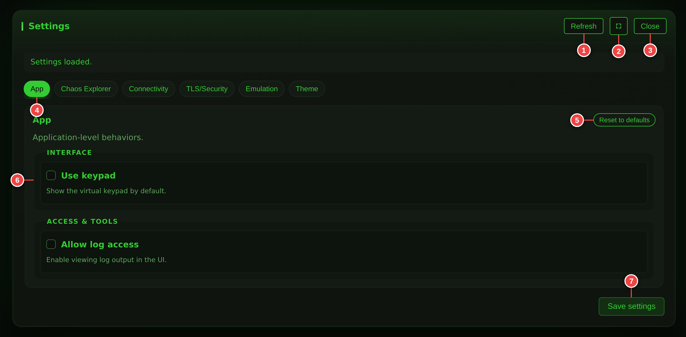

# Connect and Use 3270Web

This page explains connection setup and the full Settings modal from a user perspective.

## Connect to a Host

You can connect to:

- `hostname:port` (example: `mainframe.example.com:23`)
- `IPv4:port` (example: `10.0.0.5:23`)
- `IPv6:port` (example: `[::1]:23`)
- `sampleapp:<id>` for bundled sample targets

If autoconnect is enabled, 3270Web will connect automatically on startup.

## Open Settings

1. Click the Settings icon in the toolbar.
2. Use tabs to switch sections.
3. Edit values.
4. Click **Save settings**.
5. If prompted, restart 3270Web to apply startup-level changes.

You can also use:

- **Refresh** to reload current values
- **Reset to defaults** inside each settings section
- **Maximize** for easier editing of long values

## Toolbar Callouts

{: .doc-medal }
{: .doc-medal-wrap }

1. **Disconnect** — end the session (asks for confirmation)
2. **Logs** — open the log viewer (only enabled when `Allow log access` is on)
3. **Print screen** — render the current screen for printing
4. **Recording** — expand the recording and playback group
5. **Chaos** — expand the chaos exploration group
6. **Command palette** — search every action (++ctrl+k++)
7. **AI chat** — show or hide the AI side panel
8. **Settings** — open the settings modal
9. **Workspace mode** — switch between Business and Engineering

The eye icon to the left of the palette button hides the header and
toolbar for a distraction-free terminal; click it again to bring them
back.

!!! note "Business mode is the default"

    The screenshot above is **Engineering** mode, which is why callouts 4
    and 5 are visible. In **Business** mode — what you get on a fresh
    browser — the recording and chaos groups are hidden and the toolbar
    carries only what an application user needs. Callout 9 switches
    between them, and the choice persists per browser. See
    [Keyboard and Controls](keyboard-and-controls.md) for the full
    breakdown.

## Settings Modal Callouts

{: .doc-medal }
{: .doc-medal-wrap }

1. Refresh values
2. Maximize/restore modal
3. Close settings
4. Section tabs
5. Reset section to defaults
6. Active section content
7. Save settings

## Settings Sections (Full)

The modal has six tabs: **App**, **Chaos Explorer**, **Connectivity**,
**TLS/Security**, **Emulation**, and **Theme**.

### Connectivity

Controls how 3270Web reaches the host.

Includes:

- Port, connect timeout
- IPv4/IPv6 preference
- Proxy settings
- callback/script port and socket options

Use this section when you need alternate network routing or script protocol listeners.

### TLS/Security

Controls TLS certificate and protocol behavior.

Includes:

- Certificate verification toggle
- Min/max TLS protocol
- Client certificate and key files
- CA file/directory/chain
- Accepted hostname and client certificate name

Use this when connecting to secured hosts with custom certificate requirements.

### Emulation

Controls terminal identity and data representation.

Includes:

- Terminal model (`3278`/`3279` variants)
- Host code page
- Terminal/device/user identity options
- NVT mode and oversize behavior

This section directly affects screen size, field positions, and recording reliability.

### App

Controls application-level UI features.

Includes:

- `Allow log access`
- `Use keypad` (show virtual keypad by default)
- **Terminal Font** dropdown — pick from the three bundled IBM 3270-style fonts (Regular, Semi-Condensed, Condensed). See [Terminal Fonts](terminal-fonts.md) for usage notes.

Use this section to control log visibility and default keyboard UI behavior.

### Theme

Controls the look of the terminal and surrounding UI.

Includes:

- **Theme** — seven built-in themes plus any custom themes you define:
  Yorkshire Mainframe Terminal (default), Authentic 3270, Amber Phosphor,
  Midnight Cyan, Paper Terminal, Neon Grid, and Ocean Ops
- **Terminal Font** — the three bundled IBM 3270-style fonts
- A custom theme editor for authoring your own palette

Themes can also be switched straight from the [command
palette](keyboard-and-controls.md#command-palette) without opening
Settings.

### Chaos

Controls chaos exploration defaults.

Includes:

- `CHAOS_MAX_STEPS`
- `CHAOS_TIME_BUDGET_SEC`
- `CHAOS_STEP_DELAY_SEC`
- `CHAOS_SEED`
- `CHAOS_MAX_FIELD_LENGTH`
- `CHAOS_FORCE_OVERRIDE_EXISTING_INPUTS` — overwrite prefilled input fields more aggressively to maximise exploration.
- `CHAOS_SCREEN_DEDUP_SIMILARITY` (default `0.95`) — similarity threshold for merging near-duplicate screens in the discovery map. Higher is stricter.
- `CHAOS_LEARNED_INPUT_REUSE_BIAS` (default `1.0`) — weight applied to known-good input values when generating new field writes.
- `CHAOS_LEARNED_KEY_REUSE_BIAS` (default `1.0`) — how often the engine retries AID keys that have previously caused a transition versus exploring untried keys.
- `CHAOS_EXPORT_SUCCESS_BALANCE` (default `1.0`) — when exporting the chaos workflow JSON, balances steps drawn from successful transitions against exploratory steps.
- `CHAOS_OUTPUT_FILE` — **file name** for the exported workflow JSON. Written into the chaos runs directory; any directory component is dropped. See the note in [Chaos Mode](chaos-mode.md#jsonl-transition-log).
- `CHAOS_EXCLUDE_NO_PROGRESS_EVENTS`

Use this section to tune how aggressively chaos mode explores screens and where optional output should be written. See [Chaos Mode](chaos-mode.md) for a deeper walkthrough of the bias settings.

## Settings Not Exposed in the Modal

A number of `s3270` options are supported by the configuration file and
environment variables but deliberately have no field in the Settings
modal. Set them in `webapp/WEB-INF/3270Web-config.xml` or as environment
variables before starting 3270Web:

| Purpose | Variables |
|---|---|
| Startup automation | `S3270_EXEC_COMMAND`, `S3270_LOGIN_MACRO`, `S3270_HTTPD`, `S3270_MIN_VERSION` |
| Diagnostics/tracing | `S3270_TRACE`, `S3270_TRACE_FILE`, `S3270_TRACE_FILE_SIZE` |
| Misc | `S3270_XRM`, `S3270_SET`, `S3270_CLEAR`, `S3270_UTF8`, `S3270_COOKIE_FILE` |

Use the tracing variables when troubleshooting host interaction issues,
and the startup variables for scripted launch flows.

## Opt-in capabilities

Four capabilities are off until an environment variable turns them on. Each
one either opens a door to something outside this process or writes something
that outlives the session, which is why none of them has a checkbox in the
Settings modal — turning one on should be a deployment decision, made once,
where the rest of the deployment is described.

| Variable | Default | What it enables |
|---|---|---|
| `API_TOKEN` | unset | The whole of [`/api/v1`](rest-api.md). Unset, every route on it answers 503. One shared credential for one operator: with `AUTH_MODE=local` the instance refuses to start with it set, and clients use [a token per account](authentication.md#api-tokens) instead |
| `ALLOW_SAMPLE_APPS` | off | Letting the headless API start a bundled sample app. It is a listener this process opens on your behalf |
| `ALLOW_SCREEN_TRACE` | off | [Screen tracing](rest-api.md#apiv1sessionsidscreen-trace), which writes every screen the terminal draws to a file on the server — including whatever was typed into a field the host did not mark hidden |
| `EMBED_ORIGINS` | unset | Framing the terminal in a page on another origin, and calling the API from one. Names the exact origins; there is no wildcard. See [Embedding 3270Web](embedding.md) |
| `AUDIT_LOG_PATH` | `audit.log` beside the account store | Where the [audit trail](authentication.md#the-audit-trail) is written. It is always on; this only moves it |
| `TRUST_PROXY_HEADERS` | off | Believing `X-Forwarded-Proto`, so cookies keep their `Secure` flag behind a proxy that terminated TLS. Only set it when a proxy really is in front of this server — the header is set by whoever sends the request |

`ALLOW_LOG_ACCESS` is the fifth, and it does have a Settings field — see
[Log Access](#log-access) below.

## UI Conveniences

A few quality-of-life behaviours worth knowing about:

- **Collapsible toolbar sections** — the Recording and Chaos toolbar
  groups collapse with a chevron and remember their state, so a busy
  toolbar can be trimmed to just the controls you care about.
- **Required hostname input** — the connect form marks the hostname
  field as required and announces missing-value errors to assistive
  tech, so it is harder to accidentally submit an empty form.
- **Saved host deletion confirmation** — removing a saved host profile
  pops a confirmation modal; the destructive action cannot fire on a
  single mis-click.
- **Destructive disconnect styling** — the Disconnect toolbar button is
  visually tagged as destructive (warning tint at rest) so it is
  distinct from the safer navigation buttons next to it.
- **Toast notifications** — short-lived theme-aware toasts surface the
  result of background actions (save, export, error) without taking
  focus.
- **Command palette** — ++ctrl+k++ opens a searchable list of every
  toolbar and modal action, including controls inside collapsed Recording
  and Chaos groups, plus one-key theme switching. See
  [Command Palette](keyboard-and-controls.md#command-palette).
- **Operator information area** — the status bar under the terminal
  reports keyboard state, model, screen size and cursor position. The
  keyboard field is colour-coded: green when unlocked, amber when the
  host has locked input, red on an error condition.
- **Resizable AI chat panel** — drag the panel's left edge (or focus it
  and use ++left++/++right++) to change its width. The size is remembered
  between sessions.

## Log Access

If log access is enabled in settings, you can open the Logs modal from the toolbar and:

- Turn verbose logging on/off
- Refresh logs
- Copy/download logs
- Clear logs

## Running Behind a Reverse Proxy

When a reverse proxy terminates TLS, the hop from the proxy into 3270Web is
plain HTTP. The app cannot see the browser's real scheme on its own, so
session cookies would be issued without the `Secure` flag even though the
user is browsing over HTTPS.

Set `TRUST_PROXY_HEADERS=true` so 3270Web reads `X-Forwarded-Proto` and marks
its cookies `Secure` accordingly.

!!! warning "Only enable this behind a proxy you control"
    `X-Forwarded-Proto` is just a request header. If 3270Web is reachable
    directly, any client can set it and assert that its own plain-HTTP
    connection is secure. Leave this unset unless every route to the app
    passes through a proxy that overwrites the header.

Ensure the proxy sets the header on the way through, for example in nginx:

```nginx
proxy_set_header X-Forwarded-Proto $scheme;
```

## User Accounts

3270Web has no sign-in by default. Set `AUTH_MODE=local` to require one — see
[User Accounts and Sign-In](authentication.md) for first-run setup, the
account CLI and session lifetimes.

## Secret Settings

Values 3270Web treats as secrets — currently `S3270_KEY_PASSWORD` and
`S3270_PROXY`, which commonly carries credentials — are write-only. The
Settings API reports whether each is set and shows `********` in place of the
value; it never returns the value itself.

Saving the settings form with the mask still in the field leaves the stored
secret untouched. To change one, type the new value; to remove one, clear the
field.

## Best Practices

- Keep one known-good model/code page profile per host environment.
- Apply TLS changes carefully and verify certificate paths.
- Prefer debug playback for new recordings before running full play mode.
