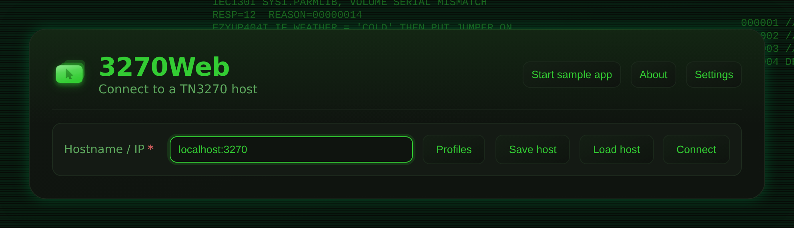
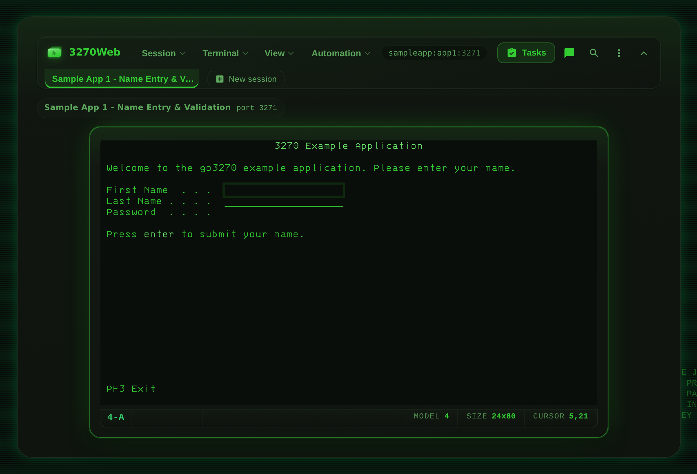
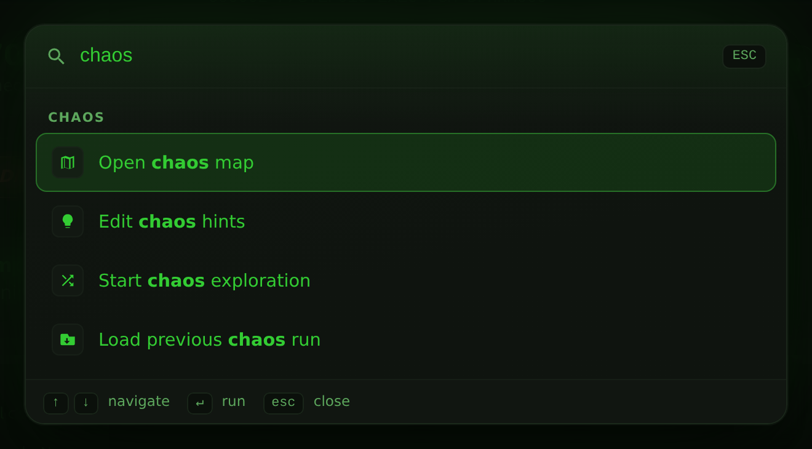
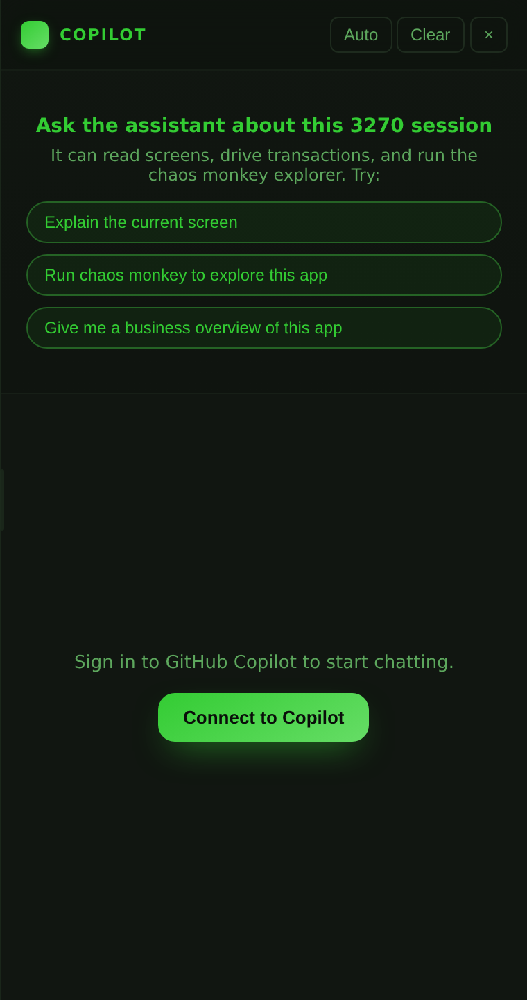
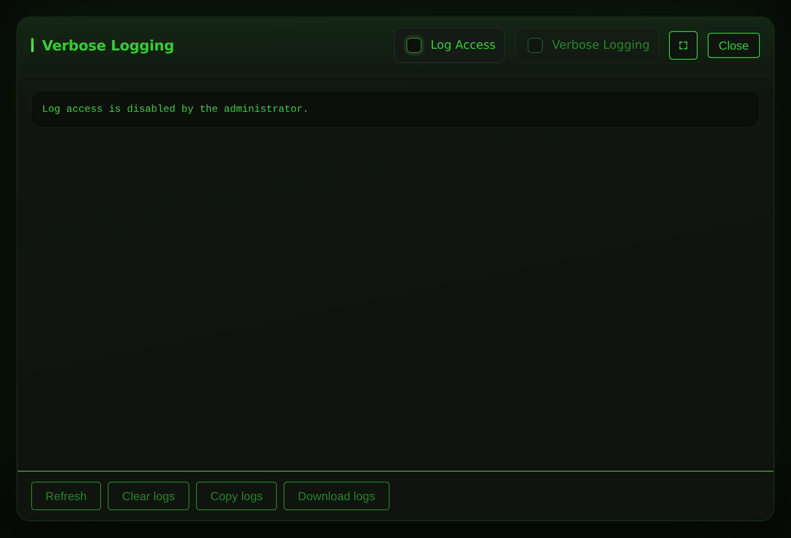
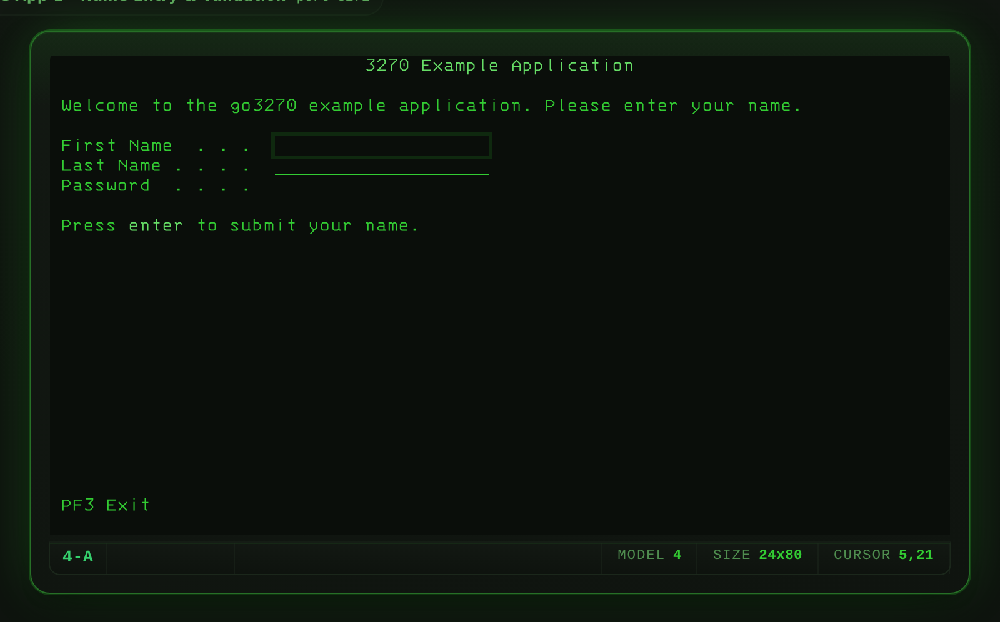

---
hide:
  - toc
---

 Open source · v1.8.6

# The mainframe, in a browser tab

No emulator install. No thick client. Open a tab, connect to any TN3270 host, and work
exactly like you would at a real 3270 terminal — then let AI Chat, chaos exploration and
workflow recording do the heavy lifting.

[Install and run](installation.md){ .md-button .md-button--primary }
[Connect a host](configuration.md){ .md-button }
[REST API](rest-api.md){ .md-button }

  

    
    session · tn3270
    model 2 · 24×80
  

  <pre class="term-body">$ docker run -p 8080:8080 \
    ghcr.io/3270io/3270web
› listening  http://localhost:8080  [up]
› connect    mvs.example.com:992    [ok]
› negotiate  IBM-3278-2-E          [tn3270e]
› recording  12 actions captured   [rec]
› </pre>

Install steps1binary, Docker or Compose

Client software0any modern browser

Bundled fonts3IBM 3270 web faces

Export targetJSONreplayable by 3270Connect

## Feature Highlights

-   :material-robot-excited: **AI Chat Mode**

    ---

    Drive any 3270 session by typing plain English. The AI reads the current screen, proposes field fills and key presses, and waits for your approval before acting. Toggle **Auto Mode** to let it run hands-free.

    [:octicons-arrow-right-24: AI Chat Mode](ai-chat.md)

-   :material-lightning-bolt: **Chaos Exploration**

    ---

    Auto-discover every navigation path on a host. Chaos mode fills fields with generated values, presses AID keys, and records every screen transition — then exports a reusable workflow JSON ready for load testing with [3270Connect](https://github.com/3270io/3270Connect).

    [:octicons-arrow-right-24: Chaos Mode](chaos-mode.md)

-   :material-record-circle: **Workflow Recording & Playback**

    ---

    Capture terminal actions as portable JSON. Replay them with a single click, step through them one action at a time in debug mode, or hand the file to any CI pipeline.

    [:octicons-arrow-right-24: Recordings and Playback](workflow.md)

-   :material-api: **REST API**

    ---

    Connect, read screens, submit input, and control chaos runs over HTTP. Wire 3270 sessions into any automation stack — scripts, pipelines, or custom tooling.

    [:octicons-arrow-right-24: REST API](rest-api.md)

-   :material-fingerprint: **Host Compatibility Profiler**

    ---

    Probe any TN3270 host and capture its negotiated terminal model, protocol options, capabilities, and timing as a JSON document. Same schema as `3270Connect -profile`, so profiles diff cleanly across tools and environments.

    [:octicons-arrow-right-24: Host Compatibility Profiler](host-profiler.md)

-   :material-compare-horizontal: **Chaos Mind-Map Compare**

    ---

    Diff two previously-exported chaos mind maps to surface field and transition divergence between hosts — ideal for migration-readiness checks against Rocket Enterprise Server stand-ins.

    [:octicons-arrow-right-24: Chaos Mind-Map Compare](chaos-compare.md)

-   :material-format-font: **IBM 3270 Terminal Fonts**

    ---

    Three bundled 3270-style web fonts (Regular, Semi-Condensed, Condensed) make the browser session look like a real 3279 display on any platform — no install, no CDN fetch.

    [:octicons-arrow-right-24: Terminal Fonts](terminal-fonts.md)

-   :material-magnify: **Command Palette**

    ---

    Press ++ctrl+k++ from anywhere — even mid-keystroke in the terminal — to search every toolbar and modal action, jump into buried chaos and recording controls, and switch themes without opening Settings.

    [:octicons-arrow-right-24: Command Palette](keyboard-and-controls.md#command-palette)

---

## Screenshots

<figure markdown>
  
  <figcaption>Connect to any TN3270 host, a saved profile, or a bundled sample app.</figcaption>
</figure>

<figure markdown>
  
  <figcaption>A live session in the default Yorkshire Mainframe Terminal theme.</figcaption>
</figure>

<figure markdown>
  
  <figcaption>++ctrl+k++ searches every action, including controls in collapsed toolbar groups.</figcaption>
</figure>

<figure markdown>
  
  <figcaption>The AI chat panel, ready to sign in. Drag its edge to resize.</figcaption>
</figure>

<figure markdown>
  
  <figcaption>The log viewer, available when <code>Allow log access</code> is enabled.</figcaption>
</figure>

<figure markdown>
  
  <figcaption>Sample App 1 running against the bundled go3270 example server.</figcaption>
</figure>

---

## First Session

1. Get 3270Web running — native Linux binary, Docker, or Docker Compose.
2. Open 3270Web in your browser (`http://localhost:8080`).
3. Enter your TN3270 host and port on the connect screen.
4. Use the terminal — keyboard shortcuts, PF keys, and field navigation all work as expected.
5. Optional: hit **Start recording** to capture the session for replay later.

[:octicons-arrow-right-24: Install and Run](installation.md)
&nbsp;&nbsp;[:octicons-arrow-right-24: Full setup guide](configuration.md)

---

## What's in This Guide

| Section | What you'll find |
|---|---|
| [Install and Run](installation.md) | Run the native Linux binary, Docker image, or Docker Compose |
| [Connect and Use 3270Web](configuration.md) | Host configuration, startup options, UI tour |
| [Recordings and Playback](workflow.md) | Record, load, play, debug, and export workflows |
| [Chaos Mode](chaos-mode.md) | Automated screen exploration and load-test export |
| [AI Chat Mode](ai-chat.md) | Conversational session control via GitHub Copilot |
| [Keyboard and Controls](keyboard-and-controls.md) | Full keyboard shortcut reference |
| [Screen Size and Model Guide](terminal-model-limits.md) | 3270 model limits and field size rules |
| [REST API](rest-api.md) | Endpoint reference for scripting and CI |
| [Host Compatibility Profiler](host-profiler.md) | Probe a host once and capture its `CompatibilityProfile` JSON for cross-environment comparison |
| [Chaos Mind-Map Compare](chaos-compare.md) | Diff two exported mind maps to surface divergence between hosts |
| [Terminal Fonts](terminal-fonts.md) | Bundled IBM 3270-style web fonts and how to switch between them |
| [Compatibility Profile Schema](compatibility-profile-schema.md) | Field-by-field reference for the shared profile JSON (v1.0.0) |
| [Feature Roadmap](feature-roadmap.md) | Planned and in-progress features |
