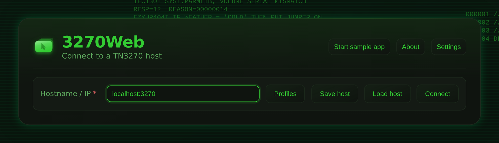
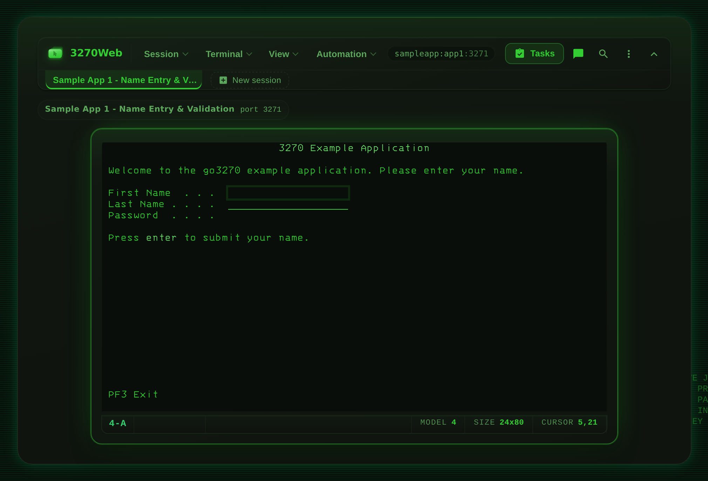
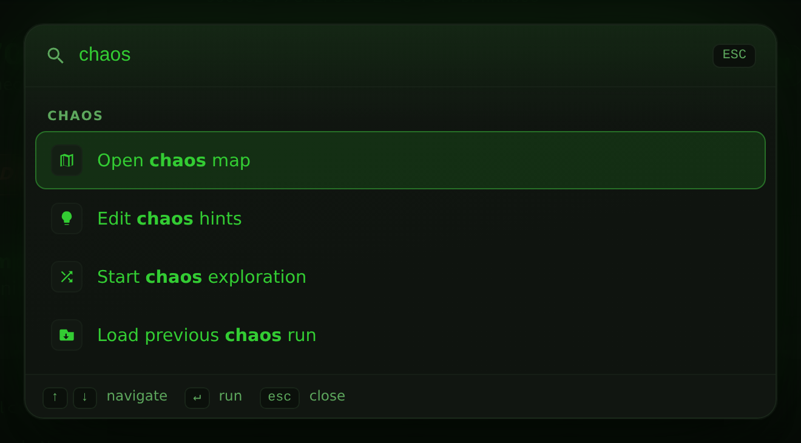
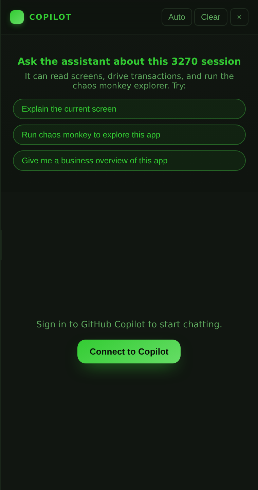
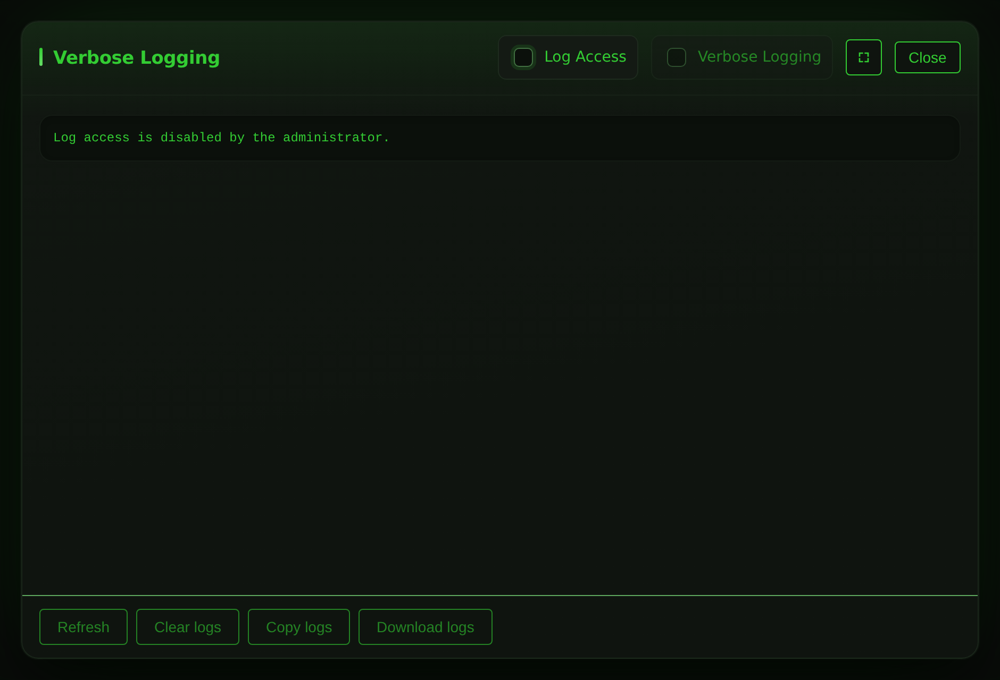
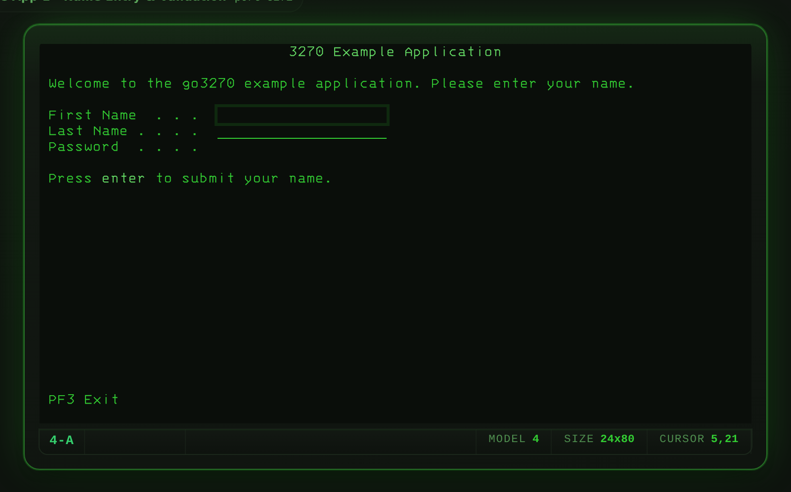

 Open source · v0.5.1

# The mainframe, in a browser tab

Connect to your mainframe in the browser. Record a useful screen flow once, then replay it instead of repeating the same keystrokes.
Self-hosted and open source. No AI account needed to use the terminal or record workflows.

[Run locally and try the sample](installation.md#your-first-terminal){ .md-button .md-button--primary }
[Watch the videos](#see-it-in-action){ .md-button }

  

    
    session · tn3270
    model 2 · 24×80
  

  <pre class="term-body">$ curl -fsSL https://3270Web.3270.io/install.sh | bash
› method     binary · docker · compose  [ask]
› listening  http://localhost:3270      [up]
› connect    mvs.example.com:992        [ok]
› negotiate  IBM-3278-2-E              [tn3270e]
› recording  12 actions captured       [rec]
› </pre>

Run it your waySelf-hostedbinary, Docker or Compose

Client software0any modern browser

Repeat workRecord → replayportable screen workflows

Export targetJSONreplayable by 3270Connect

## No mainframe? Start here

[Run locally](installation.md#your-first-terminal), open the app and choose **Try the sample terminal**. The bundled Petstore starts without a host address or port decision. Open the catalogue, view a product, then choose **Record a workflow** in the quick-start strip to capture those steps. AI setup is optional.

## See It in Action

3270Web in under a minute — connect, sign on, work the screens, the command
palette, and where the automation lives. Recorded from a live session against
the bundled sample application; nothing is mocked.

Eight more short walk-throughs — connecting, recording and replaying a
workflow, chaos exploration, themes and fonts, keyboard and keypad, running
several hosts at once — live on the
[Demonstration Videos](demo-videos.md) page.

---

## Feature Highlights

-   :material-robot-excited: **AI Chat Mode**

    ---

    Drive any 3270 session by typing plain English. The AI reads the current screen, proposes field fills and key presses, and waits for your approval before acting. Toggle **Auto Mode** to let it run hands-free. Bring your own AI: GitHub Copilot, Claude, OpenAI, Google AI, Ollama, or any OpenAI-compatible endpoint.

    [:octicons-arrow-right-24: AI Chat Mode](ai-chat.md)

-   :material-lightning-bolt: **Chaos Exploration**

    ---

    Auto-discover every navigation path on a host. Chaos mode fills fields with generated values, presses AID keys, and records every screen transition — then exports a reusable workflow JSON ready for load testing with [3270Connect](https://github.com/3270io/3270Connect).

    [:octicons-arrow-right-24: Chaos Mode](chaos-mode.md)

-   :material-record-circle: **Workflow Recording & Playback**

    ---

    Capture terminal actions as portable JSON. Replay them with a single click, step through them one action at a time in debug mode, or hand the file to any CI pipeline.

    [:octicons-arrow-right-24: Recordings and Playback](workflow.md)

-   :material-api: **REST API**

    ---

    Connect, read screens, submit input, and control chaos runs over HTTP. Wire 3270 sessions into any automation stack — scripts, pipelines, or custom tooling.

    [:octicons-arrow-right-24: REST API](rest-api.md)

-   :material-fingerprint: **Host Compatibility Profiler**

    ---

    Probe any TN3270 host and capture its negotiated terminal model, protocol options, capabilities, and timing as a JSON document. Same schema as `3270Connect -profile`, so profiles diff cleanly across tools and environments.

    [:octicons-arrow-right-24: Host Compatibility Profiler](host-profiler.md)

-   :material-compare-horizontal: **Chaos Mind-Map Compare**

    ---

    Diff two previously-exported chaos mind maps to surface field and transition divergence between hosts — ideal for migration-readiness checks against Rocket Enterprise Server stand-ins.

    [:octicons-arrow-right-24: Chaos Mind-Map Compare](chaos-compare.md)

-   :material-format-font: **IBM 3270 Terminal Fonts**

    ---

    Three bundled 3270-style web fonts (Regular, Semi-Condensed, Condensed) make the browser session look like a real 3279 display on any platform — no install, no CDN fetch.

    [:octicons-arrow-right-24: Terminal Fonts](terminal-fonts.md)

-   :material-magnify: **Command Palette**

    ---

    Press ++ctrl+k++ from anywhere — even mid-keystroke in the terminal — to search every menu and modal action, jump straight to a chaos or recording control, and switch themes without opening Settings.

    [:octicons-arrow-right-24: Command Palette](keyboard-and-controls.md#command-palette)

---

## Screenshots

<figure markdown>
  
  <figcaption>Connect to any TN3270 host, a saved profile, or a bundled sample app.</figcaption>
</figure>

<figure markdown>
  
  <figcaption>A live session in the default Yorkshire Mainframe Terminal theme.</figcaption>
</figure>

<figure markdown>
  
  <figcaption>++ctrl+k++ searches every action, including everything inside the menus.</figcaption>
</figure>

<figure markdown>
  
  <figcaption>The AI chat panel, ready to connect a provider. Drag its edge to resize.</figcaption>
</figure>

<figure markdown>
  
  <figcaption>The log viewer, available when <code>Allow log access</code> is enabled.</figcaption>
</figure>

<figure markdown>
  
  <figcaption>Sample App 1 running against the bundled go3270 example server.</figcaption>
</figure>

---

## First Session

1. [Install and run](installation.md#your-first-terminal) the native binary, Docker image or Compose stack.
2. Open `http://localhost:3270`. If accounts are enabled and this is a fresh instance, use the setup code from the server log to create your first administrator. Existing shared instances require an account from your administrator or organisation SSO.
3. Choose **Try the sample terminal**, or enter your mainframe hostname and port. Open **Connection options** for TLS, LU, model or code page; **Saved connections** opens your personal and shared hosts.
4. Use Tab to move between fields, Enter to submit, and the on-screen keypad for PF keys. On a phone, **Readable terminal** lets you pan without shrinking text; **Fit overview** shows all columns.
5. Choose **Record a workflow** in the first-session strip, or **Show automation**, then **Automation → Start recording**. Work through a useful flow, stop recording and replay it.

[:octicons-arrow-right-24: Install and Run](installation.md)
&nbsp;&nbsp;[:octicons-arrow-right-24: Full setup guide](configuration.md)

---

## What's in This Guide

| Section | What you'll find |
|---|---|
| [Demonstration Videos](demo-videos.md) | Short recorded tours — the terminal, recording and replay, chaos, themes, keyboard |
| [Install and Run](installation.md) | Run the native Linux binary, Docker image, or Docker Compose |
| [User Accounts and Sign-In](authentication.md) | Turn on accounts, create the first administrator, manage people |
| [Running a Shared Instance](multi-user.md) | What one account is kept from another, API tokens, host allowlist, rate limits, the audit trail |
| [Connect and Use 3270Web](configuration.md) | Host configuration, startup options, UI tour |
| [Recordings and Playback](workflow.md) | Record, load, play, debug, and export workflows |
| [Chaos Mode](chaos-mode.md) | Automated screen exploration and load-test export |
| [AI Chat Mode](ai-chat.md) | Conversational session control |
| [AI Providers](ai-providers.md) | Point AI Chat at Copilot, Claude, OpenAI, Google AI, Ollama, or your own endpoint |
| [Keyboard and Controls](keyboard-and-controls.md) | Full keyboard shortcut reference |
| [Screen Size and Model Guide](terminal-model-limits.md) | 3270 model limits and field size rules |
| [REST API](rest-api.md) | Endpoint reference for scripting and CI |
| [Host Compatibility Profiler](host-profiler.md) | Probe a host once and capture its `CompatibilityProfile` JSON for cross-environment comparison |
| [Chaos Mind-Map Compare](chaos-compare.md) | Diff two exported mind maps to surface divergence between hosts |
| [Terminal Fonts](terminal-fonts.md) | Bundled IBM 3270-style web fonts and how to switch between them |
| [Compatibility Profile Schema](compatibility-profile-schema.md) | Field-by-field reference for the shared profile JSON (v1.0.0) |
| [Feature Roadmap](feature-roadmap.md) | Planned and in-progress features |
| [Acknowledgements](acknowledgements.md) | s3270 and the x3270 family, whose protocol work 3270Web is built on |
| [Licence](licence.md) | What the AGPL asks of a deployment — and what it does not |

## Practical guides

- [Choose a browser terminal](browser-terminal.md)
- [Browser vs desktop workflows](browser-vs-desktop.md)
- [Migration screen-flow checks](migration-testing.md)
