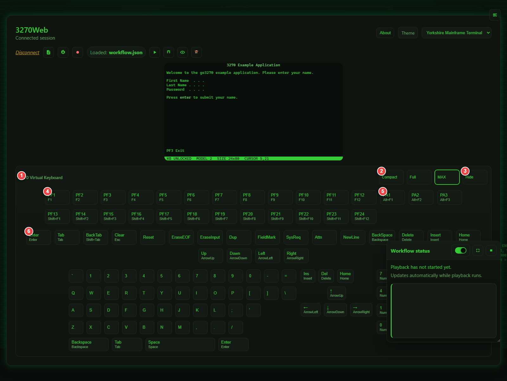

# Keyboard and Controls

This page explains toolbar controls, keyboard mappings, and the virtual keypad.

## Toolbar Controls

Main toolbar actions include:

- Disconnect session
- View logs
- Open settings
- Start/stop recording
- Load recording
- Play/debug/view/remove recording
- Playback pause/resume/stop controls (when active)

## Virtual Keyboard (Keypad)

Use the keyboard icon to show or hide the virtual keypad.

Keypad features:

- Compact and full modes
- PF keys (`PF1` to `PF24`)
- PA keys (`PA1` to `PA3`)
- Common editing/navigation keys
- Dedicated Hide button

The keypad visibility preference can be saved in Settings (`Use keypad`).

1. Keypad title area
2. Compact/full mode toggle
3. Hide keypad
4. PF key groups
5. PA key group
6. Common 3270 action keys

## Physical Keyboard Mappings

Common mappings used by 3270Web:

- `Enter` -> Enter
- `Tab` -> Tab
- `Shift+Tab` -> BackTab
- `Esc` -> Clear
- `Arrow keys` -> Cursor movement
- `Home` -> Home
- `Backspace` -> BackSpace
- `Delete` -> Delete
- `Insert` -> Insert
- `F1..F12` -> `PF1..PF12`
- `Shift+F1..Shift+F12` -> `PF13..PF24`
- `Alt+F1` -> `PA1`
- `Alt+F2` -> `PA2`
- `Alt+F3` -> `PA3`

Additional 3270 actions available in keypad/full mappings include Reset, EraseEOF, EraseInput, Dup, FieldMark, SysReq, Attn, and NewLine.

## Focus and Input Behavior

When you press mapped keys, 3270Web sends the action to the host and refreshes the terminal content. Cursor-aware behavior is preserved for field input where possible.

## Tips for Reliable Use

- Keep browser focus on the terminal area while typing.
- Use the keypad for less common 3270 keys if your keyboard layout does not expose them.
- If commands appear out of sync, pause briefly and retry in debug playback mode.
