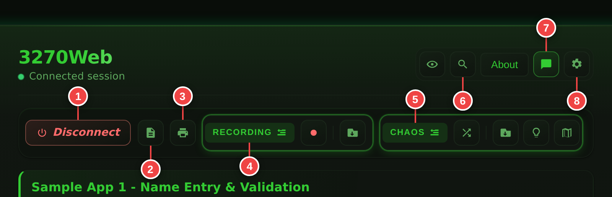
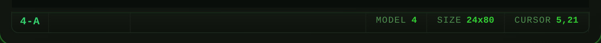
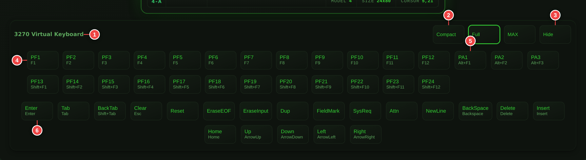

# Keyboard and Controls

This page explains the menu bar, keyboard mappings, and the virtual keypad.

## The menu bar

Everything you can do to a session lives in one bar across the top: named
drop-downs on the left, a small cluster of the actions you reach for most on
the right, and the session tabs beneath.

| Menu | Holds |
|---|---|
| **Session** | Connection profiles, connection details, reconnect, print screen, disconnect |
| **Terminal** | Find on screen, copy screen, screen history, file transfer, keyboard mapping |
| **View** | Focus mode, hotspots, virtual keypad, terminal size, theme |
| **Automation** | Recording, playback and chaos exploration (Engineering mode only) |

To the right of the menus: **Tasks**, the AI chat panel, the command palette,
an account and settings menu, and the chevron that collapses the whole bar.

{: .doc-medal }
{: .doc-medal-wrap }

The bar works from the keyboard the way a desktop menu bar does. Tab to a
menu, then:

| Key | Does |
|---|---|
| ++down++ / ++up++ | Open the menu, and move through its items |
| ++left++ / ++right++ | Move to the menu either side, open |
| ++enter++ | Run the highlighted item |
| a–z | Jump to the next item starting with that letter |
| ++esc++ | Close the menu; again to hand the keyboard back to the terminal |

While a menu is open the terminal does not see your keystrokes — the arrows
walk the menu rather than moving the 3270 cursor — and when you run an item
the keyboard goes straight back to the screen.

**Collapse the bar** with the chevron at the right-hand end when you want the
height back. A single chevron stays behind to bring it out again, and the
choice is remembered per browser. For the whole screen, use focus mode below.

### Focus mode

++alt+enter++ (or the expand icon in the header, or the command palette)
gives the terminal the whole screen. It is the long-standing full-screen
convention for terminal emulators.

- The card framing, background and application chip all go.
- The menu bar and session tabs move into a slim rail at the top that stays
  hidden until you move the pointer to the top edge or tab into it. A small
  accent mark at the top centre shows where it is.
- The terminal grows to fill the space, and the browser goes true
  fullscreen — so it fills the *display*, not just a window.
- The OIA always stays. It is the operator's instrument panel, and hiding
  `X SYSTEM` would defeat the point of having it.

Leave with ++alt+enter++ again, the toggle in the rail, or by leaving
fullscreen (++esc++ or ++f11++). The choice is remembered per browser.

The rail overlays nothing: the terminal reserves its height, so the top row
of the screen — which on a 3270 is the title and message line — is never
covered when the rail slides out.

### File transfer (IND$FILE)

**Terminal → File transfer** (also in the command palette) sends a file to
the host or receives one, using IND$FILE.

- **Host file** is the dataset or file name — `USER.DATA(MEMBER)` for a PDS
  member.
- **Mode** is text (with ASCII/EBCDIC translation and line-ending handling)
  or binary.
- **New dataset options** — record format, record length, block size and
  space allocation — sit behind a disclosure, because they only matter when
  sending to a dataset that does not exist yet.

!!! warning "The session has to be at a command prompt"

    IND$FILE is a program that runs *on the host*, so the session must be
    somewhere that can start it — a TSO READY prompt, ISPF option 6, or the
    CMS prompt. A transfer started from inside an application screen will
    fail, and the host's own error is what gets reported back.

Uploads are capped at 16 MiB and downloads at 64 MiB. IND$FILE moves data
over the 3270 data stream, which is slow — a large transfer takes minutes,
and the dialog says so while it runs.

### Connection profiles

TLS, the LU name, the terminal model and the code page used to be
server-wide environment variables, so every session in a deployment shared
them. A **connection profile** makes them per-host, which is what lets one
host run on TLS while another runs in the clear, or a model 2 against one
application and a model 4 against another.

A profile holds a name, host, port, optional TLS (with or without
certificate verification), optional LU name, terminal model and code page,
and a description.

- **Profiles** on the connect page picks one and connects.
- **Profiles** in the terminal header manages the list.
- The **+ New session** button in the tab bar opens the same picker.

When it is picking a session to open rather than managing the list, the
picker also offers the [bundled sample apps](sample-apps.md) and a box to
type an address into, so there is always something to connect to — including
on an instance that has no profiles yet and no mainframe to reach.

**Bundled sample app** at the top of the editor points a profile at one of
those apps. Choosing it fills in the host and port and clears TLS, which the
sample apps do not speak; typing over the host afterwards puts the list back
to "a mainframe on the network". A profile pointing at a sample app is listed
by the app's name rather than by the `sampleapp:` address it is dialled with.

Each profile shows the target exactly as s3270 will see it — for example
`L:Y:LU01@mainframe:992` — so what you check is what actually gets dialled.
`L:` is TLS, `Y:` means certificate verification is off, and `LU01@` pins
the logical unit.

!!! warning "Skip certificate verification is weaker than TLS"

    It encrypts the connection but accepts any certificate, so it does not
    protect against an impostor host. It is badged differently for that
    reason, and cannot be set on a profile that is not using TLS.

!!! note "Profiles are server-side"

    Unlike the browser's saved-hosts list, profiles live on the server, so
    they are shared by everyone using that deployment and survive a cleared
    cache. They are stored in `profiles.json` beside the app.

### Connection details

**Connection** in the terminal header — or "Connection details" in the
command palette — shows what the terminal knows about its own link to the
host. None of it is on the screen.

That matters because a session can render perfectly and still be connected
on terms nobody chose. TN3270E may have failed to negotiate, the host may
have bound a different LU from the one the profile asked for, TLS may not
be in force. The application looks the same either way. This is the only
place the difference shows, and it is the first thing worth reading out on
a support call.

The panel leads with the fields that answer that question — state, host,
terminal name, screen size, code page, TLS, LU name, bound PLU, the
negotiated TN3270E and telnet options, connect time and byte counts — and
puts **everything the terminal reports** under a disclosure below, in the
terminal's own order. A field this build reports that the panel has never
heard of still appears; it just appears in the second list.

Two details worth knowing:

- A value the terminal reports as **empty** is shown as *none reported*
  rather than left blank. "The host bound no LU name" and "this build
  cannot tell you" are different answers.
- The longest values (copyright, proxy list, running tasks) are abbreviated
  by the terminal itself and carry a **Show** button that fetches them in
  full.

**Copy** puts the whole list on the clipboard as plain text, for pasting
into a ticket. **Refresh** re-reads it — the byte counts always move, and
the connection state moves exactly when it matters.

The same information is on the [REST API](rest-api.md#get-apiv1sessionsidquery)
for scripted checks.

### Sessions and tabs

You can keep up to six host sessions open at once. The tab bar sits directly
under the menu bar and is there from the moment you connect, showing the one
session you have and a **+ New session** button at the end of the row.

- **+ New session** opens another one. Where you sign in to a
  [selection screen](session-manager.md), it opens another selection screen —
  that is the host list you were given, and a second one beside it would only
  disagree with it. Otherwise it asks in the same picker
  **Session → Connection profiles** uses: your connection profiles, the
  bundled sample apps, or an address you type.
- Click a tab to switch to it.
- The **×** on a tab closes that session; the others keep running. A single
  tab has no **×** — closing your only session is a disconnect, and
  **Session → Disconnect** is where that lives.
- **Disconnect** ends only the session you are looking at — the confirmation
  names it. If other tabs are open you land on one of them rather than back at
  the connect page.

    Disconnecting your last session leaves you at the connect page even where
    signing in would normally put you straight onto a host. Disconnect means
    you wanted out; asking again is a click away, and being reconnected
    without one made the button look broken.

| Shortcut | Does |
|---|---|
| ++alt+n++ | Open another session |
| ++alt+w++ | Close the current session (when more than one is open) |
| ++alt+1++ … ++alt+9++ | Switch to that session in the bar |

These are ++alt++ chords rather than ++ctrl++ ones because the browser owns
++ctrl+t++, ++ctrl+n++ and ++ctrl+w++ and will not give them up. If you have
bound one of them to a host action in the keyboard mapping editor, your
binding wins — these are defaults, and an explicit remap is not.

All of it is in the command palette too: press ++ctrl+k++ and type
`session` for the new, switch and close commands.

Sessions are fully independent — each has its own host connection, screen,
OIA, screen history and unsubmitted input. Switching tabs reloads the page,
which is deliberate: a session owns more than the screen, and a reload is
the one way to be certain none of the outgoing session's state is left
pointing at the incoming one. The sessions themselves stay live on the
server across it, so nothing is lost.

Tabs are labelled by host. Two sessions to the same host are told apart by
port, and two to the same host *and* port are numbered in the order you
opened them.

!!! note "Sessions are per browser"

    The set of open sessions lives in a browser cookie. Opening 3270Web in
    a different browser or a private window starts from nothing, and the
    idle-session reaper still closes sessions you leave untouched for long
    enough.

### Workspace modes

The bar has two surfaces, chosen by **Engineering tools** in the account and
settings menu. The choice is remembered per browser.

**Business** is the default and shows only what you need to use a mainframe
application: the Session, Terminal and View menus, Tasks, AI chat, the
command palette and settings.

**Engineering** adds the **Automation** menu on top — recording, playback and
chaos exploration, in two labelled groups within the one menu.

Nothing is removed in Business mode — switching modes is one click, and
everything in the Automation menu remains reachable from the command palette
either way.

!!! note "Runs are always visible"

    If a recording, playback or chaos run starts while you are in
    Business mode — the AI assistant can start one — the workflow status widget
    appears anyway, and goes away again when the run ends. You are never
    left watching a terminal move on its own with no way to see why. The
    playback transport (step, pause, stop) appears under the bar for the same
    reason: controls you need in a hurry do not belong behind a drop-down.

## Command Palette

Press ++ctrl+k++ (++cmd+k++ on macOS) anywhere in the session — including
while the terminal has keyboard focus — to open a searchable list of
every menu and modal action.

- Type to filter; matches are highlighted and grouped by area.
- ++up++ / ++down++ move through results, ++enter++ runs the highlighted
  one, ++esc++ closes without doing anything.
- Recently used commands appear first when the search box is empty.
- Theme switching is available here too, so you can change the look
  without opening Settings.
- Terminal operations are here: copy the screen, copy a marked block,
  reconnect, toggle insert mode, reset the keyboard, show the keypad,
  switch workspace mode.
- Every host key is searchable but hidden from the default list, since
  twenty-four PF keys would crowd out everything else. Type `pf3`,
  `attn`, `erase` or `pa1` to reach them.
- Commands whose control is hidden are hidden too, so in Business mode
  the palette does not offer recording or chaos actions.

While the palette is open it takes over the keyboard completely, so
nothing you type leaks through to the 3270 screen underneath.

## Operator Information Area

The bar directly beneath the screen is the OIA, and it carries the same
indicators a 3270 operator has read reflexively for forty years.

| Position | Meaning |
|---|---|
| Left block | `4` online, `4-A` online and owned by an application, `–` disconnected, `?` status not yet readable |
| Input inhibit | Empty when ready. `X SYSTEM` while the host is processing. `X -f` on an operator error |
| `^` | Insert mode is on (see [Insert and overtype](#insert-and-overtype)) |
| `MODEL` | Negotiated 3270 model number |
| `SIZE` | Screen geometry in rows × columns |
| `CURSOR` | Current cursor row and column |

The two indicators on the left are the ones that matter:

- **`X SYSTEM`** means the host has the keyboard and is thinking. Wait.
  Pressing Enter again will not help. It appears the moment an AID key
  goes out, so there is no window in which the terminal looks idle while
  the host is busy.
- **`X -f`** means input is inhibited by an operator error — most often a
  letter typed into a numeric field, or a full field in insert mode. It
  will not clear on its own: press ++esc++ or `Reset`.

The terminal bezel also tints while input is inhibited, so a locked
keyboard is noticeable without reading the bar.

!!! info "Screen readers"

    Only the inhibit explanation is announced, not the whole bar. The bar
    also carries the cursor position, and announcing that on every
    keystroke made the terminal unusable with a screen reader.

## Virtual Keyboard (Keypad)

Use the keyboard icon to show or hide the virtual keypad.

Keypad features:

- Compact and full modes
- PF keys (`PF1` to `PF24`)
- PA keys (`PA1` to `PA3`)
- Common editing/navigation keys
- Dedicated Hide button

The keypad visibility preference can be saved in Settings (`Use keypad`).

{: .doc-medal }
{: .doc-medal-wrap }

1. Keypad title area
2. Compact/full mode toggle
3. Hide keypad
4. PF key groups
5. PA key group
6. Common 3270 action keys

## Touch devices

On a tablet or a phone — anything the browser reports as a coarse pointer —
3270Web adds a bar of terminal keys across the bottom of the display and makes
the screen tappable. Nothing changes on a desktop, including a desktop with a
touchscreen: a device with a keyboard already has an Enter key and does not
want a permanent bar across the bottom.

**The action bar.** Every 3270 screen ends with an AID key, and a device with
no keyboard has none, so without this the terminal is read-only. The first row
is what a screen actually ends with — Enter, Tab, back-tab, `PF3`, Clear,
Reset — sized for a thumb and placed where a thumb is. `PF…` opens a drawer
with `PF1`–`PF24`, `PA1`–`PA3`, Home, EraseEOF and Insert, scrolling
sideways: a phone cannot show two dozen function keys at a size anyone can
hit, and shrinking them until it can is how a keypad stops working.

The bar rides above the software keyboard rather than hiding behind it, which
matters because the keyboard opens exactly when a field is focused — the
moment the AID keys are needed.

Pressing a key here is the same as pressing it on a physical keyboard: the
field keeps focus, what was typed into it is still there, and the key goes
through the same path.

**Tap to place the cursor.** A tap on the protected part of the screen puts
the cursor on that cell. "Position the cursor beside your choice and press
Enter" is a whole genre of mainframe screen, and with a keyboard it is an
arrow key — with a finger it had no answer at all. A tap on an input field is
still the browser's, which is what opens the software keyboard for typing.

**Reading an 80-column screen on a narrow display.** The screen scrolls
sideways and pinch-zooms. It does not reflow, and it does not shrink to fit:
which column a character sits in is part of what a 3270 screen means, so a
line that wrapped would be a line that lied. Use the zoom control in the
terminal tools for a size that suits the device — it scales the grid, which
keeps it a grid.

**The landscape suggestion.** A phone held upright fits those 80 columns into
about 320 pixels, which works out at a four-pixel character cell. Turned
sideways the same screen gets half again as much width, so a note below the
terminal suggests it.

It is a suggestion and behaves like one. It never covers the terminal — it
sits in the space portrait leaves empty underneath, which is space the screen
cannot grow into anyway. It is not a dialog and never takes focus, so it
cannot interrupt typing. It appears because the screen is measurably cramped
rather than because the device is a phone: a tablet held upright has room for
a nine-pixel cell and is never asked to rotate. Turning the phone retires it.
Dismissing it retires it for good — somebody with rotation locked, a mounted
device, or one hand free has answered the question, and asking again on the
next screen is how a hint becomes a nag.

The full [virtual keypad](#virtual-keyboard-keypad) is still available from
the terminal tools widget, if a tablet has room for it.

## Physical Keyboard Mappings

Common mappings used by 3270Web:

| Key | Action | Where it runs |
|---|---|---|
| `Enter` | Enter | Host |
| `F1`..`F12` | `PF1`..`PF12` | Host |
| `Shift+F1`..`Shift+F12` | `PF13`..`PF24` | Host |
| `Alt+F1` / `Alt+F2` / `Alt+F3` | `PA1` / `PA2` / `PA3` | Host |
| `Esc` | Clear (**press twice**) — or Reset while input is inhibited | Host |
| `Tab` / `Shift+Tab` | Next / previous field | **Terminal** |
| `Arrow keys` | Cursor movement | **Terminal** |
| `Home` | First input field | **Terminal** |
| `Insert` | Toggle insert / overtype | **Terminal** |
| `Backspace` / `Delete` | Edit within the field | **Terminal** |
| `Alt+N` | Open another host session | **Terminal** |
| `Alt+W` | Close the current session | **Terminal** |
| `Alt+1`..`Alt+9` | Switch to that [session tab](#sessions-and-tabs) | **Terminal** |

Additional 3270 actions available from the keypad and the command palette
include Reset, EraseEOF, EraseInput, Dup, FieldMark, SysReq, Attn, and
NewLine. These have no default key of their own; the keyboard mapping
dialog below can give them one.

### Remapping the keyboard

Years of muscle memory from another terminal emulator does not transfer to
a fixed key layout, so every one of these actions can be rebound. Open
**Terminal → Keyboard mapping**, or find it in the command palette.

- **Rebind** puts the row into capture: press the combination you want and
  it is recorded. Escape cancels; the terminal never sees the keystroke.
- A key can only mean one thing, so binding a combination that is already
  in use **moves** it, and the dialog says which action lost it.
- **Default** restores one action's built-in key. **Reset all** clears
  every custom binding.
- Custom bindings *layer over* the built-ins — the defaults in the table
  above keep working unless you rebind them specifically. The greyed key
  beside each action is that built-in, shown so you can see what a key
  already does before you take it.

Combinations the browser reserves for itself (`Ctrl+W`, `Ctrl+T`, `F11`)
cannot be captured by any web page, 3270Web included.

#### Sharing and migrating a layout

Bindings are stored in the browser, not on the server. A keyboard layout
is a personal preference and there is no user identity to attach it to,
unlike a connection profile, which is deployment configuration an
administrator sets once.

- **Export** writes the bindings to a JSON file; **Import JSON** reads one
  back. This is how you move a layout to another machine or browser, and
  how a team shares a house standard.
- **Import keymap file** reads a `.KMP` keyboard file from another
  emulator directly, so a migration does not start by rebuilding
  everyone's layout by hand.

The `.KMP` dialect varies between the versions that produce these files, so
the importer is deliberately tolerant. It maps what it recognises and **reports the number of lines it
could not** rather than dropping them silently — a partial import that
tells you what is missing beats one that looks complete and is not. Check
the reported count, and rebind anything it skipped by hand.

### Cursor movement is local

Tab, Back-Tab, the arrows and Home move the cursor inside the browser and
do not contact the host. On a 3270 the cursor belongs to the terminal; the
host is told where it is exactly once, in the inbound data stream, when an
AID key is pressed.

This matters on a real network. Each of those keys used to cost a full
round-trip — submit, s3270 action, screen re-read, re-render — so tabbing
through a twelve-field screen over a WAN meant a dozen waits for movement
the host never sees. They are now instant.

One deviation from a hardware terminal is worth knowing: a field's caret
range is bounded by the text currently in it, not its full width, so
arrowing right past the end of a short value leaves the field rather than
walking its blank tail. Typing still fills the field normally.

### Cursor on protected text

The cursor is not confined to the input fields. Up and down move one row at
a time and keep the column, the arrows walk cell by cell and wrap at the
screen edges, and any cell can be the cursor's resting place — including one
in the middle of the application's own label text.

That is not a detail. A whole family of mainframe screens is driven by
cursor position rather than by field content: *"put the cursor beside your
choice and press Enter"* menus, cursor-select fields, and anything that
reads the inbound cursor address. A cursor that could only sit in an input
field cannot operate them at all.

While the cursor is on protected text:

- It is drawn as an underscore over the cell, and the fields' own carets are
  hidden, so exactly one thing on the screen looks like the cursor.
- The OIA `CURSOR` readout shows where it is, same as anywhere else.
- Typing raises `X -f`, the way a terminal refuses input to a protected
  position. Press ++esc++ or `Reset` to continue; the cursor does not move.
- The next AID key reports the position to the host. This is the payoff.

Clicking anywhere on the screen puts the cursor there. ++tab++ and
++home++ still mean *field*, so they take the cursor back into one.

When the host sends a new screen it sets the cursor, and 3270Web now
honours that even when the host parked it on protected text — a menu that
positions its own cursor beside an option keeps it there.

### Insert and overtype

The terminal starts in overtype, the 3270 default: what you type replaces
the character under the cursor. Press ++ins++ to switch to insert, which
pushes the rest of the field right; the OIA shows `^` while it is on.
Typing into a field that is already full in insert mode raises an
operator error rather than silently dropping the character.

Insert is a terminal function — pressing it never contacts the host.

### Numeric fields

Fields the host marks numeric accept only digits, `.`, `,`, `-` and `+`.
Typing anything else is refused and raises `X -f` in the OIA; press
++esc++ or `Reset` to continue. This is what a real terminal does, and it
is a round-trip faster than letting the host reject the value.

Pasting into a numeric field is treated more leniently: non-numeric
characters are stripped and the digits land. Copying an account number
that arrived with spaces or dashes in it is routine, and refusing the
whole paste over one stray character would be the wrong answer.

### Auto-skip

Fill the last position of a field and the cursor sometimes jumps to the
next field on its own. Whether it does is the application's decision, not
the terminal's, and 3270Web reads that decision the way a 3270 does.

Auto-skip is not an attribute a field carries about itself. It is the
protected+numeric attribute on the field **after** an input, and what it
controls is whether filling that input advances the cursor. So an
application can say "this field runs straight into the next one" for a date
split across three boxes, and "stop here" for a password the operator may
want to correct — using the same field-attribute byte it already sends.

The browser cannot work this out on its own: a protected field arrives as
plain text with no attributes attached to it. 3270Web resolves the rule
server-side, where the field list and its attribute bytes are, and marks
each input accordingly.

Auto-skip is independent of numeric enforcement. A numeric field is not
automatically an auto-skip one, and an alphanumeric field can be.

### Type-ahead

Keystrokes typed while the host holds the keyboard are buffered and
replayed once the screen comes back, instead of being dropped. AID keys
are deliberately *not* buffered — replaying a transaction fired against a
screen you had not yet seen is a hazard, not a convenience.

!!! warning "Escape needs a second press"

    On a 3270 terminal `Clear` wipes the entire screen, but most people
    press ++esc++ reflexively to dismiss things. 3270Web therefore arms
    `Clear` on the first ++esc++ and only sends it if you press ++esc++
    again within two seconds. Any other key — or letting the window
    elapse — cancels it.

### Moving focus out of the terminal

While the terminal has focus it captures ++tab++ so field navigation
reaches the host instead of moving browser focus. To get out to the rest
of the page, press ++ctrl+tab++ (or ++ctrl+shift+tab++).

## Hotspots

Most mainframe screens print a key legend — `F1=Help  F3=Exit  F7=Bkwd`.
With hotspots on (the default), those are clickable: click `F3` on the
screen and 3270Web sends PF3. URLs printed on a screen are clickable too
and open in a new tab.

Toggle them from **View → Hotspots** or the command palette; the choice is
remembered per browser.

Two rules keep hotspots from doing anything surprising:

- **Never over an input field.** `PF3` sitting inside a value someone
  typed is data, not a control, so it does not become clickable.
- **Only real keys.** `PF1`–`PF24` and `PA1`–`PA3` are recognised;
  anything outside those ranges (`F30`, `PA9`) is ignored, so a screen
  full of numbers does not sprout dead hotspots.

## Find on screen

++ctrl+f++ (or **Terminal → Find on screen**) opens a find bar over the
terminal. ++enter++ moves to the next match, ++shift+enter++ the
previous, ++esc++ closes.

This searches the screen, not the page. The browser's own ++ctrl+f++
cannot see values inside input fields — which is where the account
numbers and names actually are — and cannot match text that straddles a
field boundary. Both work here.

Stepping onto a match that sits in an input field also moves the 3270
cursor there, since someone who searched for a field is usually about to
type in it.

Outside the terminal — in the AI chat panel, in a settings field —
++ctrl+f++ is left alone and the browser's own find still works.

## Screen history

A 3270 screen is repainted in place, so once the host moves on, whatever
was there is gone. **Terminal → Screen history** (also in the command
palette) opens a read-only view of recent screens.

- ++left++ / ++right++ or the Older / Newer buttons move between screens.
- **Copy** puts the displayed screen on the clipboard.
- ++esc++ closes.

The last 50 screens are kept per session, as plain text. Consecutive
identical screens are recorded once, so the history is a record of what
you saw rather than of how often the browser polled.

It is deliberately read-only: you cannot type into a screen from five
minutes ago, and pretending otherwise would be worse than not offering
it. History is per session and does not survive a disconnect.

## Explaining a screen

**Terminal → Explain this screen** (also in the command palette, and as the
bulb button beside the chat input) asks the AI assistant what the screen in
front of you is — useful for an unfamiliar transaction, or a panel several
steps into a flow somebody else recorded.

The screen is captured as you ask and sent with the question, so the answer
describes the screen that prompted it rather than whatever the host has
redrawn by the time the assistant replies. Follow-up questions are answered
against the same screen. Hidden password fields are masked before anything
leaves 3270Web. Setting up a provider is covered in
[AI Chat Mode](ai-chat.md).

## Copying from the screen

The screen is rendered as text with input fields spliced into it, so
dragging across it with the mouse produces mangled output — the input
values drop out of the selection. Use these instead:

- **Terminal → Copy screen** (or the command palette) copies the whole
  screen as text, including anything you have typed but not yet
  submitted. Values in hidden password fields are never copied, since
  they were never displayed.
- **Rectangular block copy**: hold ++alt++ and drag over the screen to
  mark a rectangle, then press ++ctrl+c++. ++esc++ clears the mark. This
  is how you get a column of values into a spreadsheet without the
  surrounding text coming with it.

## Reconnecting

If the host drops the connection, 3270Web notices, shows
`X DISCONNECTED` in the OIA, and retries automatically with a backoff
(1s, 2s, 4s, 8s, 15s). If it comes back, the page reloads on the new
connection. If it does not, a banner offers a manual **Reconnect**, which
is also in the Session menu and the command palette.

Reconnecting starts a new host session, so recording and chaos state from
the dead connection does not survive — the host-side conversation those
features were tracking ended when the connection did.

## Focus and Input Behavior

Host keys are sent to the host and the terminal content is refreshed.
Cursor movement, insert mode and field validation are handled locally
(see above), so only keys the host actually needs cause a round-trip.

## Tips for Reliable Use

- Keep browser focus on the terminal area while typing.
- Use the keypad for less common 3270 keys if your keyboard layout does not expose them.
- If commands appear out of sync, pause briefly and retry in debug playback mode.
