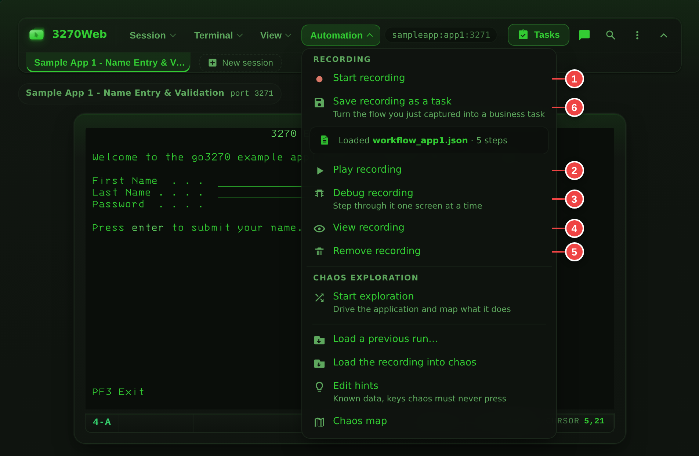

# Recordings and Playback

3270Web can capture terminal actions as JSON recordings and run them later.

## Recording and Playback Callouts

{: .doc-medal }
{: .doc-medal-wrap }

1. Start recording
2. Play recording
3. Debug recording
4. View recording JSON
5. Remove loaded recording
6. Save the recording as a business task

While a run is live, its progress shows in the strip under the menu bar and
in the Workflow Status widget.

## Record a Session

1. Connect to the target host.
2. Click **Start recording**.
3. Perform your terminal actions.
4. Click **Stop recording**.
5. Optional: click **Download** to save the generated JSON file.

## Load a Recording

1. Click **Load recording**.
2. Choose a `.json` file.
3. Confirm the filename appears as loaded in the Automation menu.
4. Click **View recording** to inspect the full JSON.

## Play a Recording

1. Load a recording.
2. Click **Play recording**.
3. Watch playback status in the strip under the menu bar and the Workflow Status widget.
4. Use **Pause/Resume** in play mode if needed.
5. Click **Stop playback** to end execution.

## Debug a Recording (Step-by-step)

1. Load a recording.
2. Click **Debug recording**.
3. Use **Step** to execute one action at a time.
4. Watch current step number/type in the status indicators.
5. Click **Stop playback** when done.

Debug mode is recommended for new or edited recordings.

## Importing a Macro File

A shop that has been driving a green screen from an installed terminal
emulator usually has a shelf of macros — and a shelf of macros is a reason not
to move anywhere. **Automation → Import a macro file…** reads one and turns it
into a recording, then tells you, line by line, what it would not translate.

The report is the point. A partial conversion that names the twelve lines
needing a person is worth more than a confident-looking one that quietly drops
four of them; the second kind is discovered in production, by a flow doing
something nobody asked it to.

1. Click **Automation → Import a macro file…** and choose the file.
2. Read the report: how many steps it produced, and every line it left out.
3. Close it. The recording is loaded, named after the macro.
4. Run it with **Debug recording** first. A translated flow has never met this
   host.

The same translation is on the API at
[`POST /api/v1/macros/translate`](rest-api.md#post-apiv1macrostranslate),
which takes no session and returns the recording itself — that is the one to
point at a directory of three hundred files.

### What it reads

Macro files in this category are written in a BASIC-family scripting language
against a session automation object model. The object name varies between the
products that write them — `Session`, `Sess0`, whatever a variable was called
— so it is ignored; the method decides everything, and parentheses are
optional as they are in the language itself.

| The macro says | The recording gets |
|---|---|
| `PutString "USER01", 5, 20` | `FillString` at row 5, column 20 |
| `MoveTo 5, 20` then `SendKeys "USER01"` | the same, from the position the macro set |
| `SendKeys "<Enter>"`, `<PF3>`, `<Clear>`, `<EraseEOF>`… | `PressEnter`, `PressPF3`, `PressClear`, `PressEraseEOF`… |
| `WaitForString "MAIN MENU", 1, 30` | `CheckValue` — that text, at that position |
| `WaitHostQuiet 2500` | 2.5 seconds of delay on the step that follows |
| `WaitHostQuiet` with no time | nothing: playback waits for the keyboard at every step already |
| `Connect`, `Disconnect` | `Connect`, `Disconnect` |
| a comment, `Dim`, `Sub`, `End Sub`, `Option Explicit` | nothing, and no note — it is scaffolding, not an instruction |

Function keys are read as `<PF3>` or `<F3>`; both mean the same key to the
host.

### What it will not do, and why

Each of these is reported against its line rather than approximated:

- **Branching, loops and subroutine calls.** A recording is a straight line of
  steps. `If`, `For`, `Do`, `Call` and the rest have no counterpart, so the
  decision has to be made before the flow runs — or the flow has to become a
  [Guided Business Task](business-tasks.md), which does have named inputs.
- **Variables.** A recording carries literal values. A macro that reads a
  balance into a variable is doing something a task's *named output* does and
  a recording cannot.
- **Text typed with no known cursor position.** `SendKeys "USER<Tab>PASS"`
  types `USER` where the macro last put the cursor, and `PASS` into whichever
  field the host moved to — which is not knowable from the file. The first
  half translates; the second is reported. Nothing is ever emitted with the
  coordinates left off, because an absent position reads as row zero to
  everything downstream, and typing into the wrong field is exactly what this
  rule prevents.
- **A wait for text with no position.** `WaitForString "BALANCE"` searches the
  whole screen; a recording checks a named row and column. Add them and it
  translates.
- **Dialogs.** A replayed recording has nobody at the keyboard to answer a
  `MsgBox`.
- **Anything outside the terminal session** — files, other applications, the
  operating system.

### Two differences in meaning worth knowing

The report names both when they apply:

- **A wait for text becomes a check, not a wait.** Playback waits for the
  keyboard to unlock before every step, but it does not poll for text. If the
  screen behind a check is slow to draw, give that step a delay.
- **Wait times are read as milliseconds.** A macro that counted in seconds
  replays faster than it ran, which is the safer way to be wrong; the step
  delays in the recording are where to correct it.

The translated recording is a recording like any other — edit it in **View
recording**, save it as a [Guided Business Task](business-tasks.md), or feed
it to chaos exploration.

!!! warning "Treat an imported recording as a secret"
    A macro that logs in has the password in it, and so does the recording it
    becomes — and so does any report line quoting that statement. The same
    caution applies as to recordings that fill sensitive fields.

## Remove a Loaded Recording

Click **Remove recording** to clear the currently loaded file from the session.

## Workflow Status Widget

The Workflow Status panel shows:

- Current step and total steps
- Current action type
- Delay range and applied delay (when present)
- Recent playback events

When you connect to a host the widget starts minimized so it stays out of the
way until you need it.

You can:

- Open it from the status indicator
- Minimize/maximize it
- Enable or disable tracking

## Recording JSON Basics

A recording includes a `Steps` array of actions.

Example:

```json
{
  "Host": "sampleapp:app1",
  "Steps": [
    { "Type": "Connect" },
    {
      "Type": "FillString",
      "Coordinates": { "Row": 5, "Column": 21 },
      "Text": "User"
    },
    { "Type": "PressEnter" },
    { "Type": "Disconnect" }
  ]
}
```

Common action types:

- `FillString`
- `PressEnter`
- `PressTab`
- `PressPF<n>` (for example `PressPF3`)

### Business metadata fields

Workflows generated from a cataloged business function (see [AI Chat — Business Understanding](ai-chat.md#business-understanding)) carry optional top-level metadata. All fields are ignored by playback, so older workflows and older 3270Web versions remain fully compatible:

```json
{
  "Host": "sampleapp:app1",
  "Port": 3270,
  "Name": "Account inquiry",
  "Description": "Look up an account balance",
  "BusinessFunction": "Account inquiry",
  "Parameters": [
    { "Name": "account_number", "Value": "1234", "Row": 5, "Column": 21, "Length": 8 }
  ],
  "Steps": [ { "Type": "Connect" }, { "Type": "PressEnter" }, { "Type": "Disconnect" } ]
}
```

`Parameters` documents which business input produced which `FillString` value and where it was written, making the file self-describing.

Parameters whose value lands in a hidden (password-style) field, or in a field the AI marked sensitive, are exported with `"Sensitive": true` and an empty `Value` in the metadata. The `FillString` step itself still carries the value — playback needs it — so treat generated workflow files that fill sensitive fields as secrets.

## Troubleshooting Playback

- Confirm host and port are correct.
- Confirm terminal model matches the one used when recording.
- Confirm screen layout and field coordinates still match host screens.
- Add delays for timing-sensitive screens.
- Use Debug mode to find the first failing step.

## Related: Chaos Exploration

Use Chaos mode when you need to discover unknown screen paths or generate new workflow steps automatically.

- Start/stop chaos from the Automation menu
- Review granular attempt status in the Workflow Status widget
- Export the generated JSON and load it back as a standard workflow

See [Chaos Mode](chaos-mode.md) for full details.
